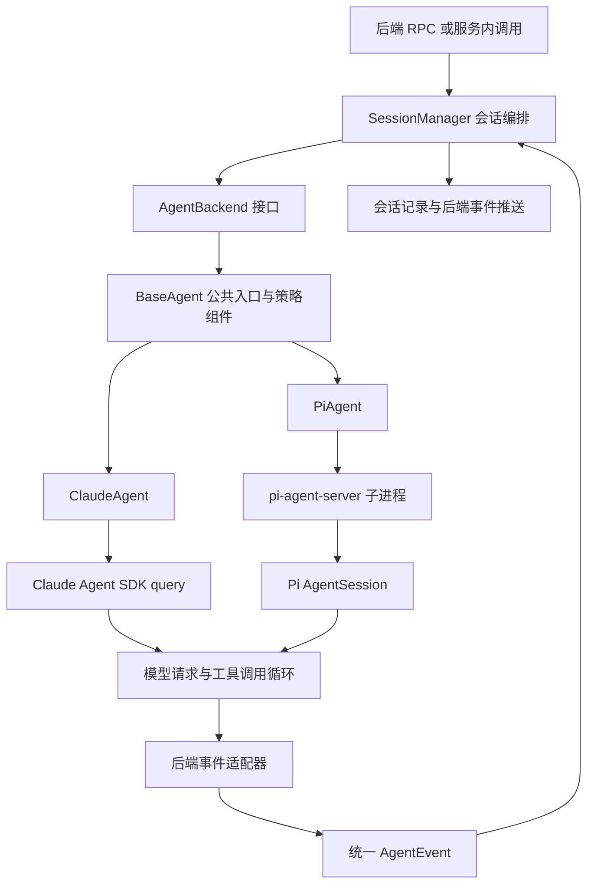

# 00：Runtime 的分层与状态归属



## 1. 这里的 Agent Runtime 是什么

Runtime 是把“模型能生成工具调用”变成“应用能长期管理一个执行中的 Agent”的整套运行机制：接收消息、选择模型、提供上下文、检查工具、流式传递结果、保存状态、处理中断和恢复。

可以概念化为：

```text
输入消息 → 请求模型 → 模型要求调用工具 → 检查并执行工具
       → 把工具结果交回模型 → 再次生成 → 最终结束
```

**这个概念循环不是 `SessionManager` 中手写的 HTTP while 循环。** Claude 路径通过 `query()`，Pi 路径通过 `AgentSession.prompt()` 把循环交给 SDK。Craft 在循环周围以及工具调用边界上实施产品策略。

## 2. 第一层：应用会话编排

源码：[SessionManager.ts](../../packages/server-core/src/sessions/SessionManager.ts)，优先搜索 `sendMessage`、`getOrCreateAgent`、`processEvent`、`onProcessingStopped`。

它维护应用能理解的状态：历史消息、是否正在处理、等待中的消息、使用的连接、Source 列表、SDK 会话标识、用量和运行中的 Agent 实例。

Java 类比是带状态管理的 Application Service：调用下层能力，编排持久化和回调。它不负责决定模型下一步调用哪个工具。

## 3. 第二层：跨后端协议与公共策略

源码：[backend/types.ts](../../packages/shared/src/agent/backend/types.ts) 的 `AgentBackend`，以及 [base-agent.ts](../../packages/shared/src/agent/base-agent.ts) 的 `BaseAgent`。

接口的核心是：

```typescript
chat(message, attachments?, options?): AsyncGenerator<AgentEvent>;
```

你可以把它理解为“发起一次执行，逐步拿到结构化事件”，而不是“等一个最终字符串”。接口还包含停止、转向、权限回复、模型设置、资源销毁等控制能力。

`BaseAgent` 采用模板方法：公共 `chat()` 先处理 Skill、分支种子和转移摘要，再调用子类 `chatImpl()`。它通过组合引入 `PermissionManager`、`SourceManager`、`PromptBuilder`、`PrerequisiteManager`、`UsageTracker` 等组件，而不是把公共规则全部复制到两个后端。

注意：[core/session-lifecycle.ts](../../packages/shared/src/agent/core/session-lifecycle.ts) 确实定义了 `SessionLifecycleManager`，但当前这三个 Agent 类没有实例化它。不要仅凭类名，把它画成真实主链路的总状态机。

## 4. 第三层：后端适配与 SDK

| 层次 | Claude 路径 | Pi 路径 |
|---|---|---|
| Craft 后端类 | `ClaudeAgent` | `PiAgent` |
| 执行入口 | SDK `query()` | 子进程收到 `prompt` 后调用 `session.prompt()` |
| SDK 交互 | SDK 异步消息流、hooks | JSONL 命令/事件 + Pi session 订阅 |
| 工具前策略 | `PreToolUse` hook | 子进程发回 `pre_tool_use_request` |
| 对外返回 | `ClaudeEventAdapter` → `AgentEvent` | `PiEventAdapter` → `EventQueue` → `AgentEvent` |

源码：[claude-agent.ts](../../packages/shared/src/agent/claude-agent.ts)、[pi-agent.ts](../../packages/shared/src/agent/pi-agent.ts)、[pi-agent-server/index.ts](../../packages/pi-agent-server/src/index.ts)。

后端类承担 Adapter 的职责：让上层不需要理解每个 SDK 的事件格式、工具注册协议和终止语义。它们也不是纯格式转换器，还处理重试、子进程和长连接状态。

## 5. 五种容易混淆的“状态”

| 对象 | 保存什么 | 生命周期/责任方 |
|---|---|---|
| Craft session | 会话 ID、消息、配置、SDK ID 等 | 应用会话，可跨重启；SessionManager + storage |
| ManagedSession | 上述数据加队列、Agent、流式缓冲等 | 宿主进程内的运行状态 |
| Agent 实例 | 后端适配器、策略组件、执行控制句柄 | 懒创建，可重建 |
| SDK session | SDK 的模型对话上下文、工具结果等 | SDK 持有，并通过各自机制续接 |
| Turn / query / process | 一轮执行、SDK query、子进程 | 三者不必同时开始或结束 |

`sessionId` 是应用会话身份；`sdkSessionId` 是底层 SDK 的续接身份。遇到 `getSessionId()`，要检查具体实现：后端会覆盖它返回 SDK ID，不能只根据 BaseAgent 中的字段名猜测。

`workingDirectory` 是用户当前工作目录；`sdkCwd` 还涉及 SDK 转录文件查找。改变工作目录不应该随意改变历史存储定位。

## 6. 这套结构体现的设计思想

**职责分离：** 会话管理不绑定模型协议，工具策略不绑定某个 SDK hook 格式。

**以事件作为集成协议：** 中间状态、工具结果、错误和完成都可以传递，应用不需要等最终答案才能工作。

**把控制权留给宿主：** 模型提出动作，宿主检查和执行；模型输出不是授权依据。

**执行状态与记录分离：** 应用需要可展示、可查询的消息；SDK 需要能继续推理的上下文，两者通过标识和恢复策略关联。

下一篇沿着入口真正走一轮：[01：消息与会话](01-message-and-session.md)。
