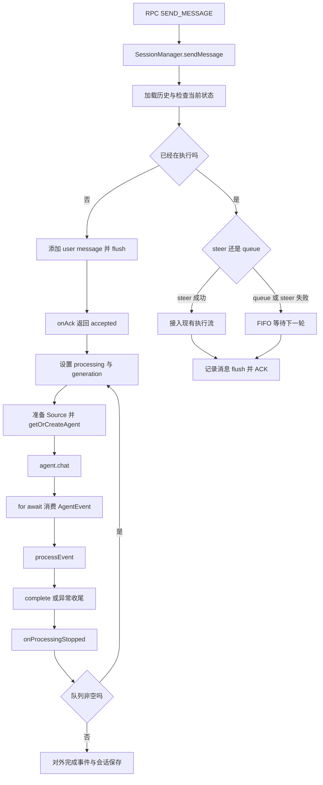

# 01：从一条消息到一轮执行



## 1. RPC 只负责接受请求与分离两种返回

入口：[handlers/rpc/sessions.ts](../../packages/server-core/src/handlers/rpc/sessions.ts)，搜索 `RPC_CHANNELS.sessions.SEND_MESSAGE`。

RPC handler 调用 `sessionManager.sendMessage(...)`，传入 `onAck`。`onAck(messageId)` 触发后，RPC 返回 `{ accepted: true, messageId }`，模型可能尚未启动。

后续文本、工具调用和错误通过会话事件推送。因此要区分：

| 信号 | 含义 |
|---|---|
| RPC accepted | 服务已接受并走过用户消息持久化刷新步骤 |
| text_complete | 一段 assistant 文本结束，可能是工具调用前的中间文本 |
| AgentEvent complete | 后端当前执行流结束 |
| 对外 session complete | SessionManager 收尾，且没有待处理消息继续执行 |

这是长任务接口常见的“请求确认 + 异步结果”结构，类似 Java 服务提交作业后返回 jobId。这里不等同于已经引入持久化 MQ。

## 2. 空闲会话：先保存输入，再启动执行

源码：[SessionManager.ts](../../packages/server-core/src/sessions/SessionManager.ts) 的 `sendMessage`。

正常新消息路径先加载历史，创建 `role: 'user'` 的消息，加入 `managed.messages`，调用 `persistSession`、`await flushSession`，然后触发 `onAck`。

为什么不只调用 `persistSession`？普通保存有 500ms 防抖；如果立刻确认并在防抖期间退出，用户会以为消息已保存，实际上还只在内存里。关键路径显式 flush 用来缩小这个丢失窗口。

这里描述的是正常 I/O 路径的确认顺序，不是数据库级持久性保证；底层写入错误处理的限制见 [07](07-events-and-storage.md)。

之后设置 `isProcessing`，清空当前流式缓冲，并递增 `processingGeneration`。

## 3. generation：防止旧请求清理新请求

简化示意：

```typescript
managed.processingGeneration++;
const myGeneration = managed.processingGeneration;
try {
  for await (const event of agent.chat(message)) {
    await processEvent(managed, event);
  }
} finally {
  if (managed.isProcessing && managed.processingGeneration === myGeneration) {
    onProcessingStopped(sessionId, 'interrupted');
  }
}
```

Java 类比是版本号检查：上一轮的异步收尾不能把下一轮的 `isProcessing` 清掉。它用于保护特定收尾路径，**不是整个方法的互斥锁**；不要把这个设计扩大理解为任何并发请求都被严格串行化。

## 4. 执行中的会话：转向与排队是不同语义

`midStreamBehavior` 决定处理方式：

- `queue`：当前任务继续，新消息进入 `messageQueue`；不调用 `redirect`，也不标记前一轮被打断。
- `steer`：调用 `agent.redirect(message)`。返回 `true` 表示后端接管转向，后续事件仍走现有消费流。
- `steer` 返回 `false`：排队重放；后端的 fallback 会请求中断，记录 `wasInterrupted`。

两种路径都会记录并刷新用户消息。重放时通过 `existingMessageId` 复用已有消息，避免在历史中再插入同一条输入。

Claude 的 steer 不是立即把一个完整新 turn 塞进模型：它暂存文本，在下一次 `PreToolUse` 注入。如果本轮没有再调用工具，会发 `steer_undelivered`，由会话层补入队列。Pi 则通过自己的 `steer` 命令交给 SDK。

## 5. 启动执行前：准备依赖

`sendMessage` 在 `agent.chat` 前处理这些事：

1. 从 `options.skillSlugs` 找 Skill 的 `requiredSources`，预启用可用 Source。
2. 刷新已启用 Source 的过期凭据，再进入可能需要连接 Source 的冷启动。
3. 调用 `getOrCreateAgent`；把全部 Source 状态和可用服务器配置提供给 Agent。
4. 若上一轮被中断，为模型输入追加提醒；原始用户消息仍按原文保存。
5. 按模型能力过滤附件，然后调用 `agent.chat`。

这段代码体现了“把可预测的准备工作放在推理前”：尽可能避免模型跑到工具调用时才发现 Source 没启用、令牌过期或附件不受支持。

## 6. 消费事件，集中收尾

`for await` 逐个拿到 `AgentEvent`，先 `await processEvent`，再处理 `complete` 等终止条件。循环退出、异常、中断都有收尾分支。

`onProcessingStopped` 清理运行状态，处理延迟元数据，检查队列：有消息就交给 `processNextQueuedMessage`；没有才发送对外完成事件，并触发内部 `emitSessionComplete` 通知。后者可供任务编排器消费。

它不会把“每个 SDK 结束事件”直接当作“整个会话没有后续工作”。

## 源码验证与思考

阅读现有测试：[sendmessage-durability.test.ts](../../packages/server-core/src/sessions/sendmessage-durability.test.ts)、[midstream-queue.test.ts](../../packages/server-core/src/sessions/midstream-queue.test.ts)。前者检查 ACK 前文件可读，后者区分排队与中断，并检查重放时间戳。

自测：模型正在查文件时，你发来“先别修改”。这句话什么时候进入模型？如果配置是 queue，是否能够阻止当前轮的修改？答案取决于投递策略，不能仅凭聊天界面已经出现这句话来判断。
