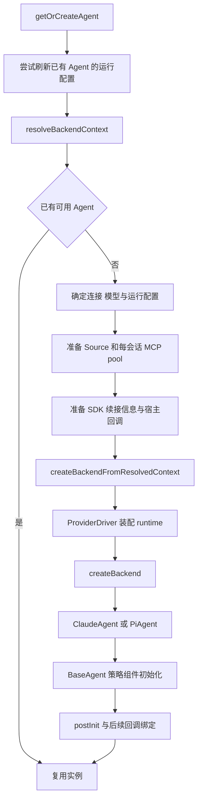

# 02：Backend 创建与依赖装配



## 1. 为什么懒创建

源码：[SessionManager.ts](../../packages/server-core/src/sessions/SessionManager.ts) 的 `getOrCreateAgent`。

存在会话记录，不代表已经存在一个运行中的 Agent。历史会话可能很多，但真正发送消息时才需要 SDK、MCP 连接、凭据和策略组件。`ManagedSession.agent` 允许为空，由调用路径按需装配。

这类似 Java 中按需创建的执行上下文，但不要把每个 Agent 想成每个 HTTP 请求都新建的无状态 Service。它可跨多轮保留 SDK 句柄和策略状态。

## 2. 先解析“运行哪一个后端”

源码：[backend/factory.ts](../../packages/shared/src/agent/backend/factory.ts) 的 `resolveSessionConnection`、`resolveBackendContext`、`providerTypeToAgentProvider`。

连接解析按会话指定连接、工作区默认连接、全局默认连接依次查找；再确定 provider、auth、model。首次解析时会把连接记录到会话并锁定，避免会话仅因全局默认设置变化就静默切换。

当前 `createBackend` 的有效分支只有两个：

```typescript
switch (config.provider) {
  case 'anthropic': return new ClaudeAgent(config);
  case 'pi': return new PiAgent(config);
}
```

`providerType` 和 `AgentProvider` 不要混淆：前者描述配置中的连接类型，后者决定选哪套执行后端。例如 `pi`、`pi_compat` 都进入 Pi 后端；Pi 再对接具体模型供应商。

某些旧注释提到 Codex/Copilot Backend，并不意味着当前 factory 还有这些独立实现。

## 3. 工厂不只负责 new

`createBackendFromResolvedContext` 调用内部 driver，解析宿主路径、准备运行时、构造后端配置，再调用 `createBackend`。

源码：[internal/driver-types.ts](../../packages/shared/src/agent/backend/internal/driver-types.ts)、[drivers/anthropic.ts](../../packages/shared/src/agent/backend/internal/drivers/anthropic.ts)、[drivers/pi.ts](../../packages/shared/src/agent/backend/internal/drivers/pi.ts)、[runtime-resolver.ts](../../packages/shared/src/agent/backend/internal/runtime-resolver.ts)。

Java 类比：工厂 + 策略 + 依赖注入。上层提供 `workspace`、会话配置、模型、回调和通用宿主信息；driver 负责 SDK 可执行文件、Pi server 等细节。这样 Electron/CLI 等宿主不用重复硬编码各后端路径。

## 4. 装配外部能力与回调

创建路径会准备 `buildServersFromSources` 的结果，并创建当前会话的 `McpClientPool`。这里“集中式 pool”是把这套 Source 连接集中到宿主端管理；不要误读成所有会话只共享一个全局 pool。

核心回调可以分两组理解：

| 回调 | 依赖方向与用途 |
|---|---|
| `onSdkSessionIdUpdate` / `onSdkSessionIdCleared` | Agent 告诉宿主底层会话身份变化，宿主更新记录 |
| `getRecoveryMessages` | Agent 恢复失败时向宿主要可用的历史摘要材料 |
| `getBranchSeedMessages` / `getTransferredSessionSummary` | 首轮上下文注入 |
| `onPermissionRequest` | 工具边界把授权需求交给宿主 |
| `onPlanSubmitted` / `onAuthRequest` | 暂停执行，把控制权交给用户或认证流程 |
| `onSourceActivationRequest` | Agent 请求宿主连接并启用 Source |

上层调用 Agent，Agent 再通过窄回调接口使用上层能力，这是一种控制反转。没必要让 `BaseAgent` 直接引用庞大的 `SessionManager`。

实际装配分阶段完成：部分回调随构造参数传入；调试和后端鉴权回调在 `postInit` 前绑定；权限、计划、Source 等回调还在后续绑定。不要把接口注释中的理想顺序当作所有回调都已提前绑定的保证。

## 5. BaseAgent 持有什么

源码：[base-agent.ts](../../packages/shared/src/agent/base-agent.ts) 的 constructor。

| 组件 | 解决的问题 |
|---|---|
| `PermissionManager` | 权限模式、命令授权和会话范围策略 |
| `SourceManager` | 可用/已激活 Source 状态及其上下文表达 |
| `PromptBuilder` | 日期、目录、权限等上下文块 |
| `PrerequisiteManager` | 工具调用前的文档阅读提醒与检查 |
| `PathProcessor` | 路径展开和规范化 |
| `UsageTracker` | 用量与上下文窗口度量能力 |

这是组合式设计。读源码时要继续追实际调用点：组件被创建，不代表所有后端都在每条路径上使用同一套计量或恢复逻辑。

## 6. 配置变化不总要重建

`getOrCreateAgent` 开头先执行 `tryRefreshAgentRuntime`，结合 runtime/restart signature 判断变化。某些变更可通过 `updateRuntimeConfig` 更新，无法就地更新时才让后续路径重新创建。

相关源码：[runtime-config.ts](../../packages/server-core/src/sessions/runtime-config.ts)。它体现了热更新与重启边界：模型参数变化、连接身份变化、进程环境变化，不能都按同一种方式处理。

阅读练习：沿 `onSdkSessionIdUpdate` 追一次从 SDK 新 ID 到宿主保存的路径，再沿 `mcpPool` 追一次从构造注入到工具执行的路径。
