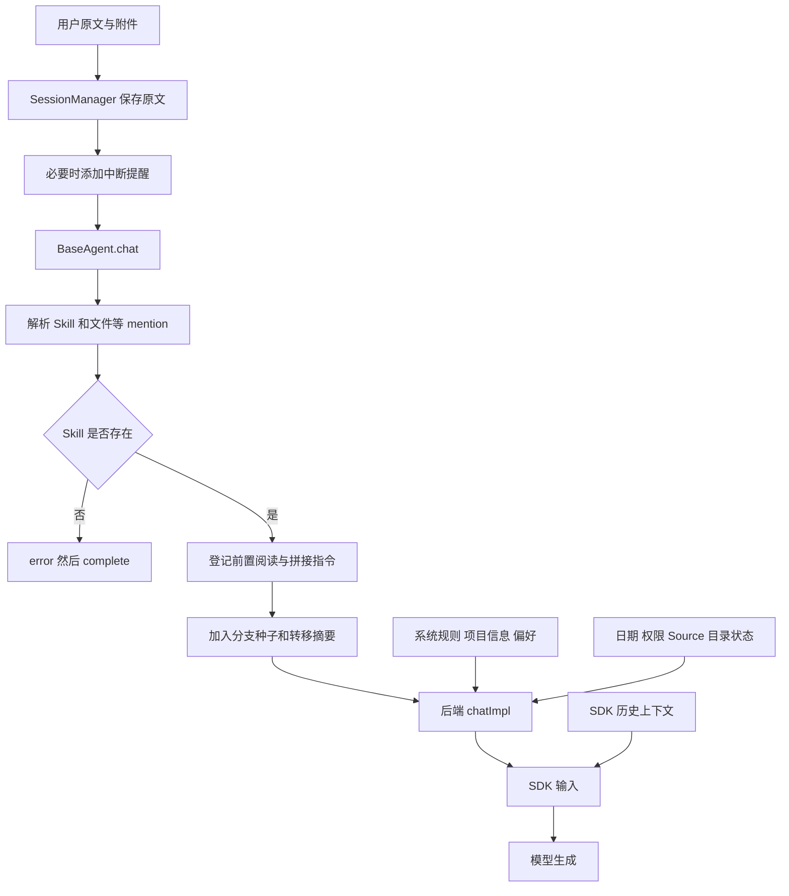

# 03：上下文如何进入模型

## 1. 输入不是一个简单的 prompt 字符串

源码入口：[BaseAgent.chat](../../packages/shared/src/agent/base-agent.ts)、[PromptBuilder](../../packages/shared/src/agent/core/prompt-builder.ts)、[getSystemPrompt](../../packages/shared/src/prompts/system.ts)。

一次模型输入通常由系统规则、SDK 保存的历史、本轮动态环境、用户输入和附件共同构成。用户发送的字符串只是其中一部分。

应用会话记录保留原始用户消息；运行时可给真正传入 SDK 的消息添加控制说明。因此，看到 `managed.messages` 的文本不能推断模型收到的全部内容；反过来，也不应把所有隐藏上下文都保存成用户亲自说的话。

## 2. BaseAgent.chat：所有后端共享的入口

执行顺序是：

1. `extractSkillPaths` 加载可用 Skill，解析 mention，解析文件和 Source 标记。
2. 被引用的 Skill 不存在时，产出 `error` 和 `complete`，本次不进入后端。
3. 将 Skill 文件路径交给 `registerSkillPrerequisites`。
4. 获取一次性的 branch seed 和 transferred summary，并标记已注入。
5. `formatSkillDirective` 生成“先读取这些 SKILL.md”的文本。
6. 把这些文本与处理后的用户输入拼接，通过 `yield* chatImpl(...)` 转交后端。

`yield*` 在这里表示把子流程产生的事件继续向外传递。可以类比模板方法中的 `doExecute`，只是返回的不是一个结果对象，而是一串异步事件。

## 3. Skill 在 Runtime 中是什么

它主要是**按需读取的操作说明 + 前置阅读状态**，不是一个自动执行的 Java 类，也不必新增一种模型工具协议。

源码：[skills/storage.ts](../../packages/shared/src/skills/storage.ts) 的 `loadAllSkills`。同名 slug 的优先级为项目 > 工作区 > 全局；合并顺序先低后高，后写覆盖先写。

显式调用时，BaseAgent 注入文件路径和阅读指令，模型再通过文件工具读正文。Claude 当前配置 `plugins: []`，并禁用 SDK 的 `Skill` 工具，这条主路径使用 Craft 自己统一的机制。

还要区分两个入口：`options.skillSlugs` 用于会话层预启用 `requiredSources`；消息中的 Skill mention 用于 BaseAgent 的阅读指令。不要把两者当成同一个参数自动完成所有工作。

前置检查的实际强度见 [06](06-tool-control.md)：它包含避免反复阻塞的降级路径，不是“模型必定已成功读完全文”的证明。

## 4. 系统规则与动态状态分开处理

`getSystemPrompt` 负责 Craft 的系统规则以及项目、偏好等信息。`PromptBuilder` 负责运行上下文块：

| 类别 | 典型内容 | 设计意图 |
|---|---|---|
| 相对稳定 | workspace capabilities、working directory | 在环境不变时尽量保持稳定 |
| 每轮可能变化 | 日期时间、权限模式、计划/数据目录、Source 状态 | 让模型看到当前事实 |
| 一次性控制 | 权限变化信号、分支种子、转移摘要 | 只在适当边界注入 |

`buildVolatileContextParts` 会消费一次性的模式变化信号。因此它不是可随意调用多遍的纯格式化方法；同一轮应复用构造结果，不要为了打印日志再构建一次。

## 5. Claude 和 Pi 的拼接策略有区别

Claude：普通 Agent 使用 `claude_code` 系统预设，再 append Craft 的系统规则；偏好等部分在首次 `chatImpl` 固定。`buildTextPrompt` / `buildSDKUserMessage` 把 `buildContextParts` 产生的上下文加入本轮输入。当前 Claude 路径仍将 volatile + stable 两部分一起放入本轮消息。

Pi：`chatImpl` 把系统规则和 stable 部分放入 `fullSystemPrompt`；volatile 部分、附件说明和实际请求组成用户消息。Pi server 用 `applySystemPromptOverride` 保证 SDK 发起 prompt 时仍使用 Craft 构建的规则。

这样安排 Pi 输入的原因是 prompt cache：每轮变化的时间或 Source 状态如果出现在历史之前的系统前缀，会破坏前缀复用。把它们放进当前消息可减少这种影响。这是源码中的缓存设计意图，并非对所有供应商命中率的保证。

源码：[claude-agent.ts](../../packages/shared/src/agent/claude-agent.ts) 的两个 `build...Prompt/Message` 方法、[pi-agent.ts](../../packages/shared/src/agent/pi-agent.ts) 的 `chatImpl`、[system-prompt-override.ts](../../packages/pi-agent-server/src/system-prompt-override.ts)。

## 6. 历史不由 BaseAgent 每轮完整重放

正常续聊依赖 SDK session 的历史，Claude 用 resume / 持久 query，Pi 用自己的 AgentSession。应用消息主要用于展示、保存和恢复材料，不是每次都转成 `messages[]` 全量发给 SDK。

恢复失败时则是另一条路径：`buildRecoveryContext` 将最近消息变成有界文本；branch seed 也有数量和长度限制。这些操作会丢失部分细节，不能等同于恢复了完整工具执行历史。

压缩同样不是把磁盘历史删掉：它调整模型上下文，应用会话记录可以仍然保留。模型压缩后可能丢失 Source guide 的细节，所以后端会重置前置阅读状态。

## 7. 附件是输入建模的一部分

会话层先检查模型是否支持图像。后端再把图片转换为多模态内容，或把文件路径、转换后的 Markdown 路径作为文字说明交给模型。Claude 与 Pi 对具体附件格式的支持和转换不同，应沿各自构建方法读，不要把“附件已保存”理解为“附件全文已经进入模型上下文”。

阅读证据：[prompt-builder-context-split.test.ts](../../packages/shared/src/agent/__tests__/prompt-builder-context-split.test.ts)。重点看稳定/易变分组与模式变化信号只消费一次的断言。
