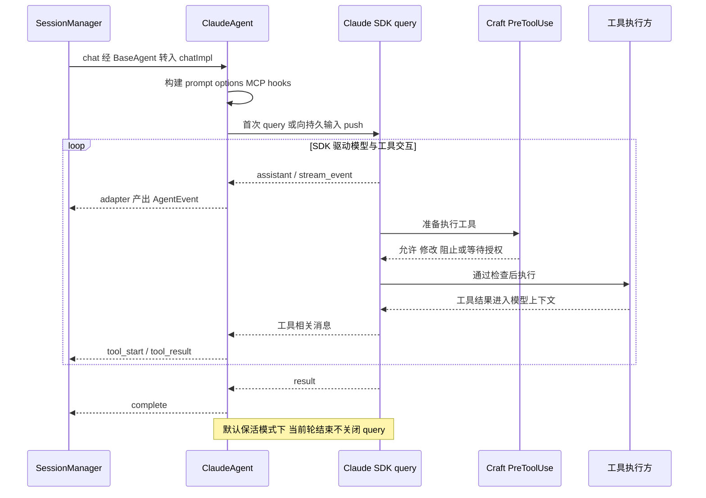
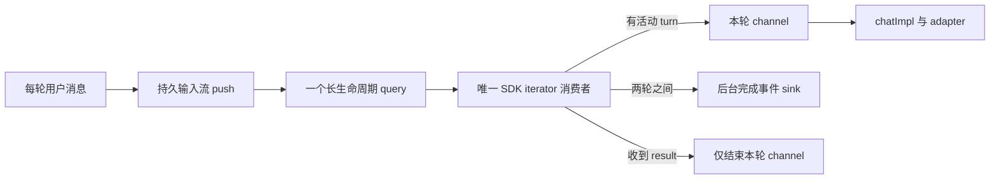

# 04：Claude 后端执行链

## 1. 入口：chatImpl 准备一次执行

源码：[claude-agent.ts](../../packages/shared/src/agent/claude-agent.ts)，搜索 `chatImpl`。

它会校验空输入，准备已固定的系统提示组成部分，建立 MCP server 配置、工具集合、thinking 选项、hook 和 resume/fork 参数，并创建控制中断的 `AbortController`。

普通 Agent 使用 SDK 的 Claude Code 系统/工具预设并追加 Craft 规则；mini 模式使用较小的提示词和工具集。mini 是一种配置模式，不能把它理解成另一套完整 Runtime。

## 2. 工具从哪里来

至少要分三类：

| 工具类别 | 接入方式 | 谁实际完成动作 |
|---|---|---|
| SDK 内置编码工具 | Claude Code tool preset | SDK 运行时 |
| Craft 会话工具 | 会话范围 SDK MCP server | Craft handler 和宿主回调 |
| 外部 Source 工具 | `createSourceProxyServers` 包装 pool 工具 | 宿主 MCP pool / Source 连接 |

所以“Claude SDK 执行工具”是驱动语义，不代表所有工具实现都位于 SDK 子进程。它可以调用宿主提供的代理工具。

## 3. 真正的模型循环在哪里

本仓库调用 `query({ prompt, options })`，消费 SDK 产生的消息。模型选择工具、工具结果回到对话、模型继续推理，这些底层循环由 SDK 驱动。

`for await (const message of turnMessageSource)` 是**读取执行事件的循环**。不要把它读成“循环里每次请求一次模型”；一个 SDK message 可能只是文本增量、工具结果或状态通知。

Craft 的插入点包括工具执行前 hook、MCP 代理执行、输入上下文，以及对 SDK 消息的解释和恢复处理。

## 4. 权限为什么用 bypassPermissions

配置中可以看到 `permissionMode: 'bypassPermissions'` 和 `allowDangerouslySkipPermissions: true`。这里的实现意图是关闭 SDK 自带交互授权，由 Craft 的 `PreToolUse` 承担检查，避免两套权限策略冲突。

当前代码没有使用 `canUseTool` 作为授权入口；注释也说明 bypass 模式会遮蔽它。实际流程是 `runPreToolUseChecks → 转换 hook 返回值`，详见 [06](06-tool-control.md)。

因此不能只看到配置名称就得出“没有权限控制”的结论，也不能仅看到有 hook 就把它当成 OS 沙箱。权限检查覆盖什么，要读其实际判定逻辑。

## 5. 默认保活：一个 query，多轮输入

源码：[persistent-input.ts](../../packages/shared/src/agent/backend/claude/persistent-input.ts)，以及 `beginPersistentTurn`、`startPersistentConsumer`。

当前 `resolveKeepBackgroundTasksAlive` 默认返回开启；环境变量 `CRAFT_KEEP_BG_AGENTS_ALIVE=0` 或 `false` 可关闭。这个结论来自当前常量和判断，不来自仍残留在其他位置的“默认每轮子进程”旧注释。

保活路径分成两个通道：

第一次创建 query，后续轮向同一个输入流 `push`。消费者是唯一读取 SDK iterator 的地方，避免多个循环竞争 `.next()`。收到 `result` 时只结束本轮 channel，使 `chatImpl` 收尾而保留底层执行环境。

保活的主要动机是后台子任务可以跨越主 turn 的结束。若直接退出并关闭原 query，它们可能随执行环境消失。两轮之间仍消费 SDK 输出，还能避免管道积压。

`/compact` 等受支持的 slash command 走单独的每轮 query 分支；不要把普通消息的保活路径套用到所有请求类型。关闭保活时，文本或多模态输入也走每轮 query 路径。

## 6. SDK 消息怎样变成 Craft 事件

源码：[ClaudeEventAdapter](../../packages/shared/src/agent/backend/claude/event-adapter.ts)。

SDK 的 `assistant`、`stream_event`、`user`、`result`、`system` 等消息，转换为 `text_delta`、`text_complete`、`tool_start`、`tool_result`、`complete` 等。

需要注意 SDK 的 `user` 消息可能携带工具结果，并不总是人类新发的一句话。适配器还需要等待 stop reason 来区分中间文本和最终文本，处理工具父子关系、用量及后台通知。

`chatImpl` 同时从消息中捕获 SDK session ID，调用 `onSdkSessionIdUpdate` 让会话层保存，以供续接和分支定位使用。

## 7. 主链路之外的两个控制点

`redirect` 在有 live query 时暂存消息，下一次工具前 hook 注入；未投递成功则通过 `steer_undelivered` 交回上层处理。

`interruptForHandoff` 用合作式 `query.interrupt()` 处理计划提交/鉴权交接；`forceAbort` 使用 `AbortController.abort`。两者意图不同，不能随意互换。

阅读证据：[persistent-input.test.ts](../../packages/shared/src/agent/backend/claude/persistent-input.test.ts)、[claude-background-message-routing.test.ts](../../packages/shared/src/agent/__tests__/claude-background-message-routing.test.ts)、[claude-agent-handoff.test.ts](../../packages/shared/src/agent/__tests__/claude-agent-handoff.test.ts)。
