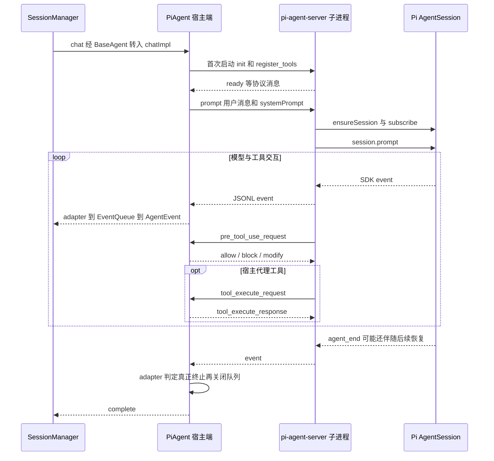

# 05：Pi 后端与进程间控制链

## 1. 为什么有一个独立 pi-agent-server

源码：[pi-agent.ts](../../packages/shared/src/agent/pi-agent.ts) 和 [pi-agent-server/index.ts](../../packages/pi-agent-server/src/index.ts)。

`PiAgent` 留在宿主进程，管理会话集成、策略、凭据和 Source 代理；Pi SDK 运行在子进程。两者通过 stdin/stdout 上的一行一个 JSON 的协议通信，stderr 用于诊断。

这类似 Java 中通过进程管道调用一个 worker。它提供执行环境和故障边界，但本身不等于权限沙箱。

`ensureSubprocess` 实现懒启动；已有子进程可复用。`spawnSubprocess` 准备路径、环境和初始化消息，并等待就绪信号。`handleLine` 按消息类型分发，不只是收模型文本。

## 2. prompt 命令进入 SDK

`chatImpl` 开始时重置当前轮 EventQueue 和适配器状态，确保子进程存在，处理 `/compact`，构建系统提示与本轮上下文，再发送 `type: 'prompt'`。

server 的 `handlePrompt`：

1. 工具定义变化时，释放旧 Pi session，让新会话装配完整工具集。
2. `ensureSession` 准备模型、凭据运行时、工具和 SDK session。
3. 应用 Craft system prompt override。
4. 重新订阅 `handleSessionEvent`。
5. 等待正在进行的压缩，再调用 `session.prompt(..., { streamingBehavior: 'followUp' })`。

SDK prompt 驱动模型循环。server 在异常路径还会发送终止性错误和合成 `agent_end`，避免宿主一直等待一个不会再来的结束事件。

## 3. 工具注册包含名称与实现两个维度

`ensureSession` 建立内置读写、Bash、搜索等工具，以及 Source/会话代理工具。`wrapToolsWithHooks` 给执行方法增加前置审批等逻辑。

当前 SDK 集成中，`customTools` 接收工具定义，`tools` 接收启用的**名称列表**。仅创建 ToolDefinition 不代表它已经被 SDK 激活。这个区别类似“注册一个 Spring Bean”与“把它加入某条业务路由”是两件事。

模型会看到名称、描述和参数 schema；Runtime 还必须持有 execute 实现和策略包装。工具设计至少同时包含这两个面。

## 4. 两条往返协议不要混为一谈

| 协议 | 解决的问题 | 返回内容 |
|---|---|---|
| `pre_tool_use_request` / response | 这次动作能否执行、输入是否要改写 | allow、block、modify |
| `tool_execute_request` / response | 宿主替代理工具完成实际动作 | content、isError |

内置工具可以在子进程通过检查后执行；代理工具则还要请求宿主执行。

`PiAgent.routeToolCall` 识别会话工具，交给 `executeSessionTool`；pool 识别的 Source 工具进入 `mcpPool.callTool`。源码上方还残留 MCP/API `TODO` 注释，但当前函数体已包含 pool 路由，应以函数体为准。

所有等待通过 requestId 与 pending map 关联。可以类比 `Map<RequestId, CompletableFuture<Response>>`：写出请求，把 future 保存在 map，收到回复再完成它。

## 5. EventQueue：把推送事件变成可消费流

源码：[event-queue.ts](../../packages/shared/src/agent/backend/event-queue.ts)。

宿主收到 JSONL event → `handleSubprocessEvent` → `PiEventAdapter.adaptEvent` → `eventQueue.enqueue`；`chatImpl` 在另一侧 `for await (const event of eventQueue.drain())`。

队列没有事件时挂起 Promise，有事件时唤醒；`complete()` 标记不会再等待新的事件，但已有事件仍被排空。它是内存中的流转换设施，不是 Kafka，不提供跨进程重启恢复或有界积压控制。

## 6. agent_end 不一定代表整个 Craft turn 完成

源码：[PiEventAdapter](../../packages/shared/src/agent/backend/pi/event-adapter.ts)。

Pi SDK 遇到可重试错误，可能先产生 `agent_end { willRetry: true }`，再退避并重新运行。上下文溢出也可能先结束一次尝试，再压缩并继续。

如果宿主看到第一个 `agent_end` 就关闭队列，后面恢复成功的答案会丢失。因此适配器维护 retry/overflow 状态，`shouldCompleteQueue` 决定真正何时关闭队列。失败尝试的部分文本还会产生 `text_discard`，防止它与重试答案混在一起。

这是这里最值得学习的兼容设计：**上游 SDK 的事件边界，未必等于产品需要呈现的任务边界。**

## 7. 阅读重点

按 `chatImpl → send → handlePrompt → ensureSession → handleSessionEvent → handleLine → handleSubprocessEvent → EventQueue.drain` 追一圈，再插入两条工具往返协议。

阅读现有测试：[pi-event-adapter.test.ts](../../packages/shared/src/agent/__tests__/pi-event-adapter.test.ts)、[pi-retry-sdk-integration.test.ts](../../packages/shared/src/agent/__tests__/pi-retry-sdk-integration.test.ts)、[event-queue.test.ts](../../packages/shared/src/agent/__tests__/event-queue.test.ts)。

Pi server 的 SDK 依赖版本见 [package.json](../../packages/pi-agent-server/package.json)。理解本仓库接入边界后，再决定是否深入依赖包内部，第一遍无需展开所有供应商协议实现。
