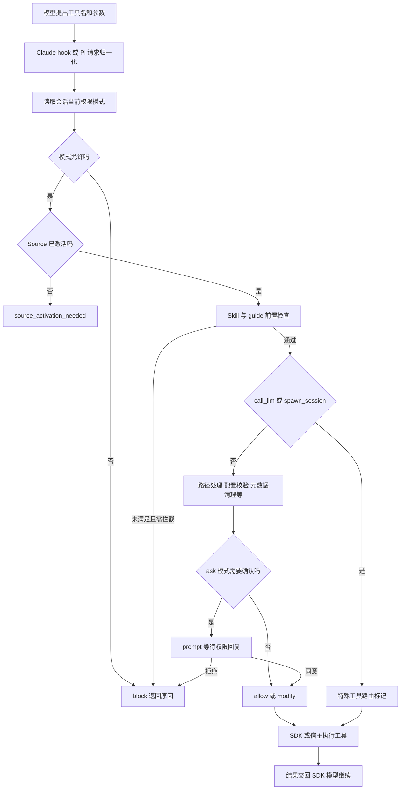

# 06：工具执行前的控制链

## 1. 策略统一，执行适配分开

源码：[core/pre-tool-use.ts](../../packages/shared/src/agent/core/pre-tool-use.ts) 的 `runPreToolUseChecks`。

两个后端先把自己的工具调用信息归一化为 `toolName`、`input`、`sessionId`、目录、Source 列表和策略组件等，再调用共享检查函数。

函数返回的是判定结果，不是直接调用 SDK：`allow`、`modify`、`block`、`prompt`、`source_activation_needed`，以及 `call_llm_intercept` / `spawn_session_intercept`。后端再把结果翻译为自己的 hook 返回值或 JSONL response。

Java 类比是返回 sealed result 的策略服务，SDK adapter 负责协议转换。这里也有前置阅读计数等状态变化，不能假定整个检查函数完全无副作用。

## 2. 顺序本身就是策略

共享管线先从 mode-manager 读取当前模式。传入的 `permissionMode` 用于发现不一致，实际判定采用会话当前值，避免运行中的 Agent 拿着旧模式执行动作。

然后依次检查模式、Source、前置文档，再处理特殊工具，最后处理输入转换和 ask 确认。先做权限判定，可以避免模型借“先激活 Source”绕过当前模式约束。

普通输入转换包括路径展开、配置文件校验、启用 CLI 功能时的配置写入路由限制、旧 Skill 名限定、展示元数据剥离，以及可选 RTK Bash 改写。权限判断与 ask 提示主要基于原始输入，执行方可能拿到转换后的输入。

`call_llm` / `spawn_session` 的分支在通用输入转换之前返回。它们有专门的后续 handler，不能假设所有工具都完整经过完全相同的转换步骤。

## 3. 三种权限模式

源码：[mode-types.ts](../../packages/shared/src/agent/mode-types.ts)、[mode-manager.ts](../../packages/shared/src/agent/mode-manager.ts)、[permission-manager.ts](../../packages/shared/src/agent/core/permission-manager.ts)。

| 内部存储值 | 对外名称 | 阅读时的基本理解 |
|---|---|---|
| `safe` | Explore | 倾向只读，按工具、命令与目录规则允许例外 |
| `ask` | Ask | 允许的能力中，对需要授权的操作请求确认 |
| `allow-all` | Execute | 不走 ask 确认，但仍有其他管线检查 |

Explore 不是“所有写操作绝对禁用”，例如计划/数据目录有特定规则。Execute 也不意味着跳过 Source 状态、配置校验、前置文档等所有检查。需要精确行为时继续追 `shouldAllowToolInMode` 与 `shouldPromptInAskMode`。

## 4. 权限确认如何暂停工具

后端创建 Promise，把它的 resolver 记录在 `pendingPermissions`，再调用 `onPermissionRequest`。宿主收到权限回复，调用 `respondToPermission(requestId, allowed, ...)`，原来挂起的工具检查继续执行。

这类似保存一个 `CompletableFuture<Boolean>`；等待期间没有专属线程在 while 中空转。

实际实现有一个值得留意的差异：Claude 缺少权限回调时阻止需要 prompt 的工具；Pi 的对应 `prompt` 分支当前在没有回调时放行。正常 SessionManager 路径会绑定回调，但自行复用后端时不能忽略这个装配条件。

## 5. 前置阅读检查的真实边界

源码：[prerequisite-manager.ts](../../packages/shared/src/agent/core/prerequisite-manager.ts)。

设计目标是让 Agent 在使用 Source 前读 `guide.md`，在显式调用 Skill 后先读 `SKILL.md`，减少模型不知道使用约定就操作工具的情况。

实现有几处必须按代码理解：

- 普通 Source guide 与 Skill 前置条件使用 `MAX_REJECTIONS = 1`；重复未满足时有降级放行，避免模型卡死。
- Skill 检查允许 `Read` 通过，并由路径跟踪消除匹配的前置条件；不是所有 Read 都必须只读目标文件。
- `trackBashSkillRead` 当前按命令文本包含目标路径来识别，不是完整解析 shell 并验证读取成功。
- Read 跟踪发生在调用/开始阶段，不能等价于确认模型已成功收到全文。
- 内置浏览器文档规则带 `strict: true`，不同于普通 guide 的降级策略。

因此，它适合视为操作指导与工作流约束；不要把它当作权限系统或强安全隔离，也不要在文档中承诺“没读成功绝不执行其他工具”。

## 6. 工具结果有两条去向

执行结果回到 SDK，作为模型下一步推理依据；同时工具开始/结果被适配为 Craft 事件，让会话层记录和对外推送。

`SessionManager.processEvent('tool_result')` 主要管理应用侧记录，**不是由它再次把工具结果提交给模型**。这条回传已在 SDK 工具执行协议内完成。

被拒绝的工具同样需要把原因反馈给 SDK/模型，以便模型改用只读方案、先读指南或停止动作。控制层返回可理解的失败，比静默跳过更有利于闭环。

## 7. 本篇与 MCP 专题的边界

本篇解释“工具调用走到执行前后，Runtime 如何控制”。MCP 专题还要进一步拆 `tools/list`、schema、代理命名、连接池、超时重连、API Source 和大响应处理，路线见 [10](10-agent-roadmap.md)。

阅读证据：[pre-tool-use-checks.isolated.ts](../../packages/shared/src/agent/core/__tests__/pre-tool-use-checks.isolated.ts)、[prerequisite-manager.isolated.ts](../../packages/shared/src/agent/core/__tests__/prerequisite-manager.isolated.ts)、[permission-manager.test.ts](../../packages/shared/src/agent/core/__tests__/permission-manager.test.ts)。
