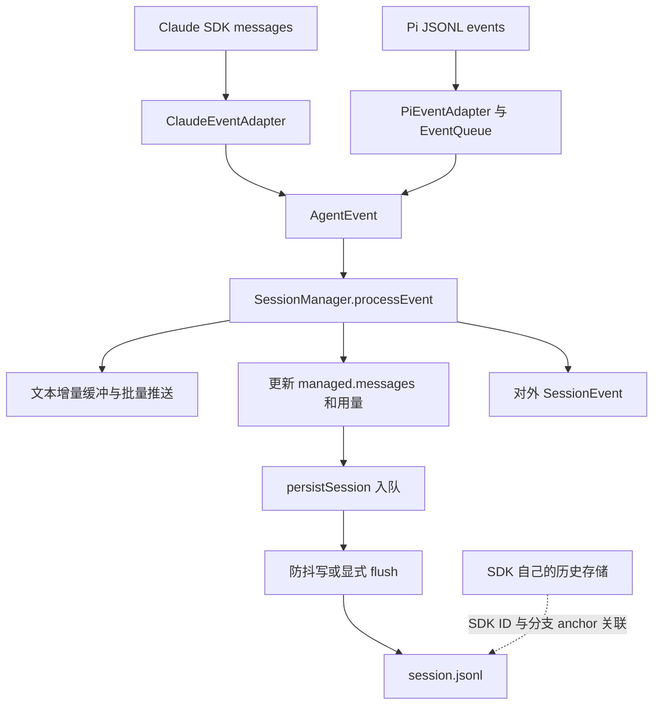

# 07：事件如何变成会话记录

## 1. AgentEvent 是后端之间的共同语言

定义：[core/types/message.ts](../../packages/core/src/types/message.ts) 的 `AgentEvent`。

它是 TypeScript 的判别联合：每个成员用不同的 `type` 表示语义，并携带该类型需要的字段。Java 可以类比 sealed interface 下面的多个 record。

| 事件 | 用途 | 是否意味着整轮结束 |
|---|---|---|
| `text_delta` | 流式文本片段 | 否 |
| `text_complete` | 一段完整文本，可标记 `isIntermediate` | 否 |
| `tool_start` / `tool_result` | 工具调用状态与结果 | 否 |
| `permission_request` | 授权控制信息 | 否 |
| `retry` / `text_discard` | 重试状态与失败文本清除 | 否 |
| `typed_error` / `error` | 错误信息 | 还要看恢复与终止分支 |
| `complete` | 当前后端执行流结束 | 是，但会话可能继续处理队列 |
| `task_completed` | 某个后台任务结束 | 不等于主会话结束 |

权限等控制信息还可能通过回调进入宿主，并非所有路径都只走 `chat()` 的事件流。理解接口时要同时看数据流和控制回调。

## 2. processEvent 是应用状态投影

源码：[SessionManager.processEvent](../../packages/server-core/src/sessions/SessionManager.ts)。

可以把它理解成 reducer：输入一个事实事件，更新内存中的会话状态，并推送应用事件、在必要时安排保存。它不是 SDK 的执行引擎。

### 文本

`text_delta` 累加到 `streamingText`，经 `queueDelta` 批量推送；当前批量间隔常量为 50ms，减少大量细碎事件带来的传输开销。

`text_complete` 先刷新剩余 delta，再生成完整 assistant Message，清空流式缓冲并安排持久化。增量用于即时输出，完整消息用于稳定记录。

`text_discard` 则清掉失败尝试的待发增量和对应缓冲，不能在丢弃前把它们补发出去，否则重试已经开始，旧文本还会冒出来。`retry` 状态本身不作为对话正文落盘。

### 工具

`tool_start` 根据 `toolUseId` 查已有记录：第一次创建执行中的 tool Message，后续同 ID 事件补充完整输入等信息。SDK 可能先给空输入，再给完整输入，所以重复开始事件不必代表重复执行。

`tool_result` 更新同一条记录的结果、错误和状态。没有对应 start 时也有 fallback 创建路径，以容纳后台工具等事件顺序。

`parentToolUseId` 描述子工具所属的父调用，不能靠“最近一个 start”猜测嵌套关系，尤其是并行任务。

## 3. 用不同 ID 解决不同关联问题

| 标识 | 关联对象 |
|---|---|
| `sessionId` | Craft 应用会话 |
| `sdkSessionId` | SDK 续接身份 |
| `messageId` | 应用消息记录 |
| `toolUseId` | 一次工具调用及其结果 |
| `parentToolUseId` | 工具调用的父子关系 |
| `turnId` / SDK message anchor | 文本分组，以及特定后端的分支定位 |
| `requestId` | 权限/进程协议中的请求回复 |

这些 ID 不可互换。比如从某条 Craft assistant 消息分支，需要找到对应 SDK anchor，而不能直接拿 Craft messageId 当 SDK transcript 的节点 ID。

## 4. 持久化的正常路径

源码：[sessions/storage.ts](../../packages/shared/src/sessions/storage.ts)、[sessions/jsonl.ts](../../packages/shared/src/sessions/jsonl.ts)、[persistence-queue.ts](../../packages/shared/src/sessions/persistence-queue.ts)。

会话文件位于 `{workspaceRootPath}/sessions/{id}/session.jsonl`：首行是 header，其后每行一个 message。header 支持快速加载列表元数据，完整消息按需要加载。

`persistSession` 构造存储数据并入队。`SessionPersistenceQueue` 默认 500ms 防抖，合并短时间内的连续保存。需要关键步骤立即写入时调用 flush；退出时可以 flushAll。

写入过程会将路径转换为可移植形式，生成完整 JSONL，写 `.tmp`，再替换目标文件。虽然文件后缀为 JSONL，这条保存路径是**重写快照**，不是每个 AgentEvent 追加一行的事件日志。

还会比较 header 签名，尝试保留外部改动的指定元数据，避免普通对话保存覆盖其他来源修改的标题、标签等。它不是通用多写者事务系统。

## 5. 实现提供的保证不要说过头

读注释时容易看到“atomic write”“durability”，但当前实现需要更精确地理解：

- 临时文件降低了直接写坏正式文件的风险；实际代码先 `unlink` 旧文件再 `rename`，中间存在目标文件缺失窗口，不能声称严格原子替换。
- 队列中的写失败会记录错误，并未在所有路径上重新抛出。所以“await flush 后 ACK”体现正常路径的可靠性设计，不代表任何磁盘故障都被成功确认机制覆盖。
- 写入不是数据库事务，也没有自动带来 exactly-once 工具执行语义。
- 当前队列虽有“过滤 intermediate”注释，`persistableMessages` 实际直接取传入 messages；判断保存内容要追真实赋值，不能仅看注释。

这些是阅读现有实现的边界说明，本次没有修改持久化代码。

## 6. 应用历史与 SDK 历史分开

Craft 的 JSONL 为产品会话服务；SDK 保存继续模型执行所需的历史。Claude resume 与 cwd 相关，Pi 在会话目录下使用 `.pi-sessions` 并通过 `continueRecent` 续接。

分支相关 sidecar 保存 Craft 消息与 SDK 节点的对应关系。Pi 的 anchor 事件要等 SDK 真正追加完成后再记录；这也是为什么不能在任意一个“文本完成”回调里猜 SDK 当前叶节点。

应用侧还会对超长工具结果做保存长度限制。存储截断与“给模型的工具结果摘要”是两个不同层面的控制，应分别追 `processEvent` 和工具大响应处理。

阅读证据：[persistence-queue.test.ts](../../packages/shared/src/sessions/__tests__/persistence-queue.test.ts)、[pi-turn-anchors.test.ts](../../packages/server-core/src/sessions/pi-turn-anchors.test.ts)。
