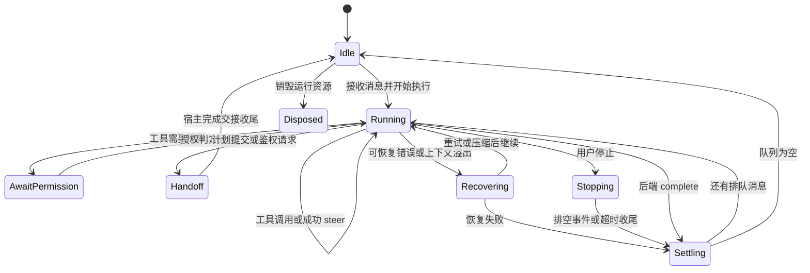

# 08：中断、恢复、压缩和后台任务

这是根据多个类整理的**概念状态图**，源码没有一个包含全部这些名称的统一 enum。后台任务可能在主 turn 进入 Idle 后继续运行，因此图中的 Idle 只表示前台消息执行流空闲。

## 1. 先区分六个动作

| 动作 | 意义 |
|---|---|
| complete | 当前执行边界结束，不一定销毁 query/进程 |
| queue | 保留消息，等当前轮结束后运行 |
| steer | 尝试在当前执行中引入新要求 |
| handoff | 暂停，把控制权交给计划审批或认证流程 |
| abort / forceAbort | 停止当前执行，具体机制由后端决定 |
| destroy / dispose | 清理运行资源，范围大于单轮结束 |

共享原因定义：[AbortReason](../../packages/shared/src/agent/core/session-lifecycle.ts)，包含 UserStop、PlanSubmitted、AuthRequest、Redirect、SourceActivated 等。原因影响后续是安静收尾、恢复还是重新发送，不应全部压成“error”。

## 2. 用户停止：先表达停止意图，再收尾

源码：[SessionManager.cancelProcessing](../../packages/server-core/src/sessions/SessionManager.ts)。

它清空等待队列并移除对应待执行消息，设置 `stopRequested`、`wasInterrupted`，调用 `agent.forceAbort(UserStop)`，发出中断信息，并设置 5 秒兜底清理。

它不会立刻把所有状态当作已结束：仍让事件消费路径排空已经到达的事件，再经 `onProcessingStopped` 收尾，避免最后的工具结果或文本片段被无意丢弃。

后端实现不同：Claude `forceAbort` 中止 AbortController；Pi 拒绝等待中的权限/执行请求、完成 EventQueue、清理恢复状态，并按原因向子进程发送 abort。

**停止不能撤回已经完成的外部副作用。** 工具写过文件或调用过远端接口，不会因为聊天 turn 中断而自动回滚。这是 Agent 执行与数据库事务的重要区别。

## 3. 计划与鉴权交接：暂停不是报错

`onPlanSubmitted` 和 `onAuthRequest` 由 SessionManager 绑定。工具提交计划或请求认证时，宿主记录状态，把当前执行交回用户侧处理。

Claude 为此提供 `interruptForHandoff`，使用 `query.interrupt()` 合作式中断，避免在 SDK 控制消息写入期间直接硬中止。后续收到尾随 complete 时，会话层检查已经停止的状态，避免重复收尾。

## 4. 恢复不是一个统一 retry 按钮

| 场景 | 主要责任方 | 处理策略 |
|---|---|---|
| 模型请求临时失败 | Pi SDK + PiEventAdapter | 保持流打开，退避后继续，必要时丢弃失败文本 |
| 模型上下文溢出 | SDK + 后端适配器 | 压缩后继续，避免过早 complete |
| SDK session 续接失败 | ClaudeAgent / PiAgent | 清理续接身份，视路径注入恢复上下文并尝试新会话 |
| 连接鉴权过期 | SessionManager `attemptAuthRetry` | 清空旧 Agent 引用，重新装配并重发，有次数状态约束 |
| Source 激活改变工具集合 | Source activation 协调链 | 更新配置，必要时重启本轮并重发 |

不要看到同名“重试”就共享同一套控制逻辑。SDK 内重试、重新创建 Agent、重发用户消息，对应用消息、工具副作用和上下文的影响不同。

`attemptAuthRetry` 用 `authRetryAttempted` 防止同一输入无限重试，并用 `authRetryInProgress` 阻止旧流的完成抢先收尾。当前函数注释写“Destroy”，该处实际操作是把 `managed.agent` 设为 null；不能据此宣称这条分支已经显式调用了 `destroy()` 清理全部旧资源。

## 5. 恢复上下文是有损补救

源码：[BaseAgent.buildRecoveryContext / buildBranchSeedContext](../../packages/shared/src/agent/base-agent.ts)。

会话层为普通 recovery 提供最近最多 6 条非 intermediate 的 user/assistant 消息；BaseAgent 再把每条截到约 1000 字符。branch seed 最多取 24 条，每条最多 1200 字符。这些数值是当前实现限制。

这类文本注入不能重建所有工具结果、附件和 SDK 内部状态；它帮助继续对话，但不等价于无损 resume。SDK 原生续接应与这种 fallback 分开理解。

## 6. 压缩要协调状态

Pi server 的 `waitForCompaction` 在新 prompt / 手动压缩前等待已有压缩，减少与 SDK 自动压缩竞争的风险；超过其等待上限仍有继续路径，不能把它称为绝对互斥锁。

PiEventAdapter 保持恢复中的 turn 不关闭；Claude/Pi 在识别压缩完成后重置 prerequisite 阅读状态。原因是“磁盘 guide 还在”不等于“模型当前上下文仍含 guide”。

Usage 统计也有两个问题：累计消耗多少 token，以及当前上下文占窗口多少。缓存读写、压缩、重试会影响解释，不能把历史累计 token 直接当成窗口占用。

## 7. Source 激活：为什么要先排空同批工具结果

源码：[source-activation-drain.ts](../../packages/shared/src/agent/source-activation-drain.ts) 以及两个后端的 `chatImpl`。

某个 `source_test` 成功后，新的工具集合可能需要下一轮才能被 SDK 采用。如果收到第一个激活信号就立刻中断，同一批并行工具中其他结果可能没来得及写入，留下只有 tool start 没有 result 的不完整历史。

`SourceActivationDrainController` 先记下重启需求，排空相关结果，再在适当边界发 `source_activated` 并中断。Claude 按 adapted batch 边界处理，Pi 使用非 tool_result/流结束边界。宿主还有自动重发的去重协调。

这里学习的是：**修改运行时能力集合，需要选择不会破坏在途操作的切换边界。**

## 8. 分支与后台任务

分支不能只复制界面消息。Claude 使用 `resume + forkSession + resumeSessionAt`，并考虑父 `sdkCwd`；Pi 用自己的 session 文件 fork，再移动到指定 anchor。Pi 这条原生分支路径在缺少父文件/anchor 时会报错，不静默降级为空白会话。其他 seeded/fallback 路径要分别读。

后台任务也不能只看主 turn 是否 complete。Claude 默认持久 query 保活，两轮间通过 background sink 接收完成通知；关闭保活时，宿主会把仍标为运行中的遗留任务标成 orphaned，避免长期报告不存在的运行状态。

SDK 内部子 Agent、Craft `spawn_session` 创建的独立应用会话、任务编排器中的任务节点是不同粒度，后续多 Agent 专题需要分别拆解。

阅读证据：[source-activation-drain.test.ts](../../packages/shared/src/agent/__tests__/source-activation-drain.test.ts)、[source-activated-auto-retry.test.ts](../../packages/server-core/src/sessions/source-activated-auto-retry.test.ts)、[claude-agent-branching.test.ts](../../packages/shared/src/agent/__tests__/claude-agent-branching.test.ts)、[pi-agent-branching-capability.test.ts](../../packages/shared/src/agent/__tests__/pi-agent-branching-capability.test.ts)。
