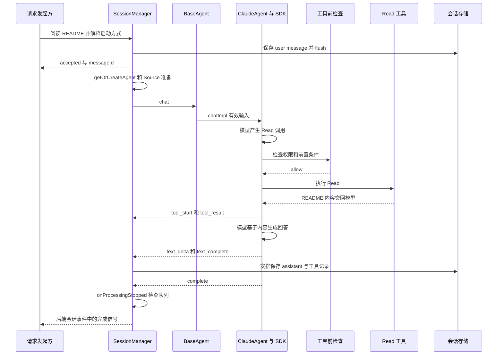

# 09：跟踪一个完整请求



图是正常路径的概念顺序，省略了部分交错事件。真实工具 start 的具体发出时点由 SDK 决定，不应把图当作毫秒级调度规范。

## 1. 场景与约束

选一个已配置 Claude 连接、没有未完成消息、无 Skill mention 的会话，输入：“请读取当前项目 README，解释如何启动项目，不要修改文件。”

这是建议的本地观察练习，本次文档编写没有替你启动模型、调用外部 Source 或执行工具。若只想读源码，不需要配置 API key。

## 2. 建议设置的源码观察点

| 顺序 | 文件与函数 | 观察什么 |
|---|---|---|
| 1 | [RPC sessions](../../packages/server-core/src/handlers/rpc/sessions.ts)：SEND_MESSAGE | `onAck` 和后续事件分开返回 |
| 2 | [SessionManager](../../packages/server-core/src/sessions/SessionManager.ts)：`sendMessage` | `messages`、`isProcessing`、generation、SDK ID |
| 3 | 同文件：`getOrCreateAgent` | 已有实例还是冷启动，解析到哪个 provider |
| 4 | [BaseAgent](../../packages/shared/src/agent/base-agent.ts)：`chat` | 原始输入如何变成 effectiveMessage |
| 5 | [ClaudeAgent](../../packages/shared/src/agent/claude-agent.ts)：`chatImpl`、`beginPersistentTurn` | 是否复用 query，如何构建上下文 |
| 6 | [pre-tool-use](../../packages/shared/src/agent/core/pre-tool-use.ts)：`runPreToolUseChecks` | 工具名、输入、实际模式与返回分支 |
| 7 | [Claude adapter](../../packages/shared/src/agent/backend/claude/event-adapter.ts)：`adapt` | SDK 原始消息如何映射 |
| 8 | SessionManager：`processEvent` | delta 缓冲、toolUseId、完整 message |
| 9 | SessionManager：`onProcessingStopped` | 当前结束是否还要启动排队消息 |
| 10 | [persistence queue](../../packages/shared/src/sessions/persistence-queue.ts)：`enqueue`、`flush` | 哪些步骤只是安排保存，哪些等待写入 |

调试时优先看状态字段、事件类型和 ID；凭据、整段环境变量和完整外部数据不需要输出到日志。

## 3. 你应该能口述的主链路

服务先记录用户消息并确认接收。会话层准备后端；BaseAgent 补充公共上下文；ClaudeAgent 将输入交给 SDK。模型要求读文件，Craft 在工具执行前检查，SDK 调用读取工具并将结果交回模型。模型继续生成答案，Craft 将 SDK 事件归一化，应用层把完整文本和工具结果保存为会话消息。收到后端 complete 后，宿主检查是否有待执行输入，再决定真正结束还是继续下一轮。

这里存在两个相互关联但不同的闭环：**SDK 的模型/工具闭环**和**宿主的消息/状态/事件闭环**。

## 4. 给场景逐步增加变化

| 变化 | 先预测 | 应定位的分支 |
|---|---|---|
| 加一个有效 Skill mention | 是自动执行脚本，还是先读说明？ | `extractSkillPaths`、`formatSkillDirective`、prerequisite |
| 引用不存在的 Skill | 会调用模型吗？ | BaseAgent 的 error + complete |
| 要求修改文件，模式为 Ask | 谁等待谁，授权回复怎么关联？ | pre-tool-use 的 prompt、pendingPermissions |
| 当前执行时发第二条消息 | 是立即转向还是下一轮再执行？ | `midStreamBehavior`、`redirect`、messageQueue |
| 点击停止 | 队列如何处理，已有工具结果是否还保留？ | `cancelProcessing`、forceAbort、drain |
| 改用 Pi 连接 | 哪些上层代码不变？ | factory 分支、PiAgent、server、EventQueue |
| Pi 出现可重试错误 | 第一个 agent_end 是否关闭会话？ | PiEventAdapter retry state |
| 应用重启后续聊 | 从哪两份历史恢复？ | session.jsonl 与 SDK session |

## 5. 用现有测试读出设计意图

先读测试名称、输入与断言，再回到实现。建议顺序：

1. [base-agent.test.ts](../../packages/shared/src/agent/__tests__/base-agent.test.ts)：公共组件与入口。
2. [event-queue.test.ts](../../packages/shared/src/agent/__tests__/event-queue.test.ts)：等待、唤醒、结束后排空。
3. [persistent-input.test.ts](../../packages/shared/src/agent/backend/claude/persistent-input.test.ts)：跨轮输入通道。
4. [prompt-builder-context-split.test.ts](../../packages/shared/src/agent/__tests__/prompt-builder-context-split.test.ts)：上下文缓存与一次性信号。
5. [midstream-queue.test.ts](../../packages/server-core/src/sessions/midstream-queue.test.ts)：queue 与 steer fallback 区别。
6. [pi-retry-sdk-integration.test.ts](../../packages/shared/src/agent/__tests__/pi-retry-sdk-integration.test.ts)：失败文本清理和重试终止边界。

若本地已经按项目要求安装依赖，可以从小范围测试开始，例如在仓库根目录执行：

```bash
bun test packages/shared/src/agent/__tests__/event-queue.test.ts
bun test packages/shared/src/agent/backend/claude/persistent-input.test.ts
```

这些是可选学习命令，不是本次已完成的测试记录。复杂 session/server 测试还要看其 mock、环境与仓库测试配置，不建议第一步运行全库测试。

## 6. 检查自己是否真正理解

能回答以下问题，就已经具备继续读 MCP/Skill 的基础：

- 为什么 `agent.chat()` 返回事件流，而不是 `Promise<string>`？
- 工具结果回到模型，和工具结果保存到 Craft，会经过同一段代码吗？
- 为什么有些 `text_complete` 后面还会继续调用工具？
- 为什么 Claude complete 后后台任务仍可能运行？
- 为什么 Pi adapter 要延迟发布 complete？
- 为什么重建 Agent 不一定创建新的应用会话？
- 为什么 `SKILL.md` 阅读检查和用户授权检查不能互相替代？
- 为什么停止或重试都不保证外部副作用只发生一次？
