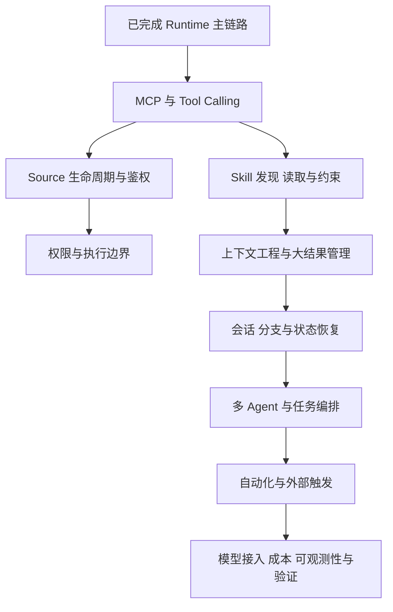

# 10：Runtime 之后，还要拆哪些 Agent 设计

下面是后续拆解路线，**不是这些专题已经全部完成的声明**。Runtime 篇已经覆盖其接入点，后续再深入各自实现。这些模块共同覆盖本项目主要的 Agent 工程设计，不包含前端。

## 1. MCP / Tool Calling：能力如何暴露并执行

建议拆为“注册链路”和“调用链路”两篇。

注册链路：Source 配置 → server builder → pool 连接与发现 → tool schema/代理名 → 后端注册 → 模型可见工具。

调用链路：模型生成工具调用 → 名称和参数归一化 → 权限与前置条件 → SDK 内置执行或宿主代理执行 → 结果处理 → SDK 继续生成。

核心问题是：模型看到的工具声明与执行实现如何绑定？外部 MCP 与内置 session tools 有何区别？为何要统一代理名？连接变化后如何刷新工具集合？超时、断线、错误、大结果如何表达？

源码入口：[mcp-pool.ts](../../packages/shared/src/mcp/mcp-pool.ts)、[proxy-tool-name.ts](../../packages/shared/src/mcp/proxy-tool-name.ts)、[server-builder.ts](../../packages/shared/src/sources/server-builder.ts)、[api-tools.ts](../../packages/shared/src/sources/api-tools.ts)、[session-scoped-tools.ts](../../packages/shared/src/agent/session-scoped-tools.ts)、[tool-defs.ts](../../packages/session-tools-core/src/tool-defs.ts)。

还要比较 Claude 的 SDK MCP server 封装、Pi 的代理协议、[session-mcp-server](../../packages/session-mcp-server/package.json) 的独立进程入口，理解“共用业务 handler，不同传输外壳”。

## 2. Source：比 MCP server 更高一层的产品能力

Source 包含配置、说明文档、认证状态、是否启用和连接状态。支持一种外部能力，并不等于它必须是远程 MCP server；API Source 同样可封装成工具。

建议链路：加载配置 → 判定 usable → 刷新凭据 → 构建 server → pool sync → 注入可用状态 → 激活/失效后更新。

源码入口：[sources/types.ts](../../packages/shared/src/sources/types.ts)、[sources/storage.ts](../../packages/shared/src/sources/storage.ts)、[token-refresh-manager.ts](../../packages/shared/src/sources/token-refresh-manager.ts)、[credential-manager.ts](../../packages/shared/src/sources/credential-manager.ts)、[SourceManager](../../packages/shared/src/agent/core/source-manager.ts)。

重点理解：配置存在、已认证、已启用、已连接、模型知道如何使用，是五个不同问题。

## 3. Skill：说明如何被发现并在适当时机加载

建议链路：扫描全局/工作区/项目目录 → 解析 frontmatter 与正文 → 同 slug 覆盖和缓存 → 显式 mention → requiredSources → 路径指令 → 文件读取 → 后续工具动作。

源码入口：[skills/storage.ts](../../packages/shared/src/skills/storage.ts)、[skills/types.ts](../../packages/shared/src/skills/types.ts)、[BaseAgent](../../packages/shared/src/agent/base-agent.ts)、[PrerequisiteManager](../../packages/shared/src/agent/core/prerequisite-manager.ts)、[skill-validate.ts](../../packages/session-tools-core/src/handlers/skill-validate.ts)。

需要回答：什么是可发现元数据，什么是按需读取正文？重复名称怎么解决？Skill 与 Source 的依赖怎么表达？为什么 Skill 不必是 MCP 工具，也不等同于子 Agent？何时缓存失效？前置检查的降级边界是什么？

本项目 Agent 加载的 `.agents/skills` 等路径，与你当前使用的其他编码助手自身的 Skill 目录不要混淆。

## 4. 权限与执行边界：把能力和授权分开

Runtime 篇介绍了控制链，后续应细拆模式判定、Bash/PowerShell 命令分析、自定义 permissions、路径边界、会话白名单、审批有效期以及配置写入保护。

源码入口：[mode-manager.ts](../../packages/shared/src/agent/mode-manager.ts)、[permissions-config.ts](../../packages/shared/src/agent/permissions-config.ts)、[bash-validator.ts](../../packages/shared/src/agent/bash-validator.ts)、[powershell-validator.ts](../../packages/shared/src/agent/powershell-validator.ts)。

阅读目标：区分提示词要求、程序级策略、SDK 权限机制和 OS 隔离；外部文档中出现的指令不能自然变成宿主授权。这里列阅读方向，不把当前项目描述为已经拥有完整沙箱保证。

## 5. 上下文工程与大结果管理

建议链路：系统规则/项目上下文 → 动态状态 → Skill/Source 文档按需读取 → 工具结果过大时保存/摘要 → 模型窗口统计 → 压缩与恢复。

源码入口：[prompts/system.ts](../../packages/shared/src/prompts/system.ts)、[prompt-builder.ts](../../packages/shared/src/agent/core/prompt-builder.ts)、[large-response.ts](../../packages/shared/src/utils/large-response.ts)、[summarize.ts](../../packages/shared/src/utils/summarize.ts)、[llm-tool.ts](../../packages/shared/src/agent/llm-tool.ts)、[usage-tracker.ts](../../packages/shared/src/agent/core/usage-tracker.ts)。

需要分别理解：模型上下文、短期会话历史、磁盘文件、用户偏好和摘要。不要把它们全部叫“长期记忆”，也不要仅因存在总结功能就假设项目有向量检索记忆系统。

## 6. 会话持久化、分支与转移

Runtime 篇覆盖主要路径，后续补全懒加载、JSONL header、队列恢复、SDK transcript 定位、分支 anchor、跨工作区/机器转移和导入导出。

源码入口：[sessions/storage.ts](../../packages/shared/src/sessions/storage.ts)、[sessions/jsonl.ts](../../packages/shared/src/sessions/jsonl.ts)、[sessions/bundle.ts](../../packages/shared/src/sessions/bundle.ts)、[SessionManager](../../packages/server-core/src/sessions/SessionManager.ts)。

重点回答：哪些内容可重新构造，哪些身份/锚点丢失后无法无损恢复？重放输入是否可能重做外部动作？

## 7. 多 Agent：区分三种粒度

| 粒度 | 应读内容 | 关键问题 |
|---|---|---|
| SDK 子 Agent / 后台任务 | 后端 task events、[list-background-tasks](../../packages/session-tools-core/src/handlers/list-background-tasks.ts) | 生命周期如何依附 query，父子调用如何关联？ |
| 独立 Craft 会话 | [spawn-session-tool](../../packages/shared/src/agent/spawn-session-tool.ts)、BaseAgent `preExecuteSpawnSession`、SessionManager `onSpawnSession` | 配置如何继承，如何建立独立会话与传递消息？ |
| Tasks 编排 | [TaskRunner](../../packages/server-core/src/tasks/TaskRunner.ts)、[tasks/schema](../../packages/shared/src/tasks/schema.ts)、[tasks/storage](../../packages/shared/src/tasks/storage.ts) | 依赖、并行度、节点输出、失败与运行日志如何协调？ |

Tasks 的入口链可以按 task spec → ready nodes → 子会话执行 → `onSessionComplete` → output → 下游节点来读。schema 能解析的节点类型不一定都已有执行实现，需要检查 runner 分支，不凭类型定义推断功能完整度。

## 8. 自动化与外部触发

建议链路：配置/触发条件 → 事件匹配或调度 → 执行脚本/发送 prompt → 进入会话 Runtime → 记录执行历史与失败。

源码入口：[automation-system.ts](../../packages/shared/src/automations/automation-system.ts)、[sdk-bridge.ts](../../packages/shared/src/automations/sdk-bridge.ts)、[event-bus.ts](../../packages/shared/src/automations/event-bus.ts)、[retry-scheduler.ts](../../packages/shared/src/automations/retry-scheduler.ts)、[messaging-gateway](../../packages/messaging-gateway/package.json)。

重点是复用 Runtime，而不是为定时任务再造一套 Agent loop。同时要分清等待执行的消息队列、SDK 事件队列与自动化调度，它们有不同持久化和失败语义。

## 9. 模型接入、可观测性与验证

连接配置不只是 model 字符串：还涉及 auth、endpoint、运行配置热更新、图像能力、thinking 和 SDK 协议适配。入口：[factory](../../packages/shared/src/agent/backend/factory.ts)、[runtime-config](../../packages/server-core/src/sessions/runtime-config.ts)、[pi model-resolution](../../packages/pi-agent-server/src/model-resolution.ts)。

可观测性按 sessionId → turn/tool/request ID 串联日志，分别观察启动耗时、首次输出、工具耗时、重试和 token 用量。错误需要区分模型供应商、工具业务、鉴权、子进程和应用状态层。

验证从事件序列和状态不变量入手：不重复结束、不丢同批工具结果、重试文本不混入最终答案、分支不读到 cutoff 后的历史、旧轮收尾不覆盖新轮。现有测试是理解这些设计动机的重要材料。

## 建议优先级

先完成 MCP/Tool Calling → Source → Skill，与你最初的三个目标直接对应。然后深入上下文/权限/会话恢复，再看多 Agent 和自动化。做到这里，就能覆盖项目 Agent 侧的大多数主要设计决策，而无需学习前端或钻研全部 TS 类型技巧。
