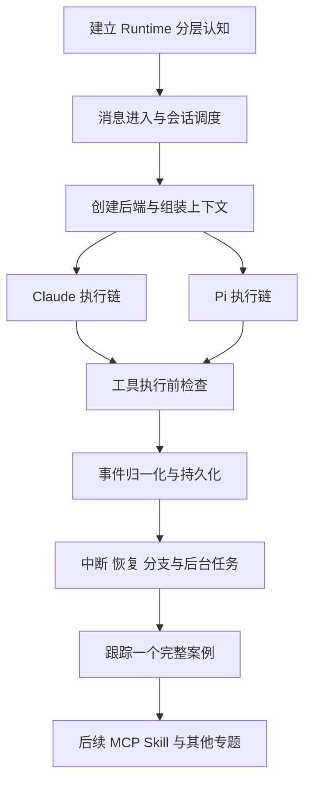

# Craft Agents：面向 Java 后端开发者的 Agent 源码导读

## 这套文档解决什么问题

你已经写过 Java 后端和 Agent，现在需要读懂这个项目的 Agent 设计，而不是先成为 TypeScript 专家。阅读时始终追问四件事：**谁接收请求、谁持有状态、谁执行动作、结果如何回到会话**。

文档基于本地源码提交 `e8963854`，记录日期为 2026-09-17。以当前实现为准，不假设其他版本行为相同。源码链接使用仓库相对路径，便于在仓库中阅读；链接到文件后搜索文中列出的函数名即可定位，不依赖容易漂移的行号。

这次完整拆解 **Agent Runtime**。MCP、Tool Calling、Skill 在 Runtime 中的接入点会讲清楚，独立实现细节列在后续路线中。范围不包含 React、组件、页面状态或样式；RPC 和事件推送只作为后端输入输出边界。

## 建议阅读顺序

| 顺序 | 文档 | 读完应能回答 |
|---|---|---|
| 1 | [00：全局分层与状态归属](00-runtime-map.md) | Craft 自己实现什么，SDK 实现什么？ |
| 2 | [01：从请求到一轮执行](01-message-and-session.md) | 消息如何接收、落盘、排队、开始处理？ |
| 3 | [02：Backend 创建与依赖装配](02-backend-bootstrap.md) | 如何选择 Claude/Pi，并准备 Source、鉴权和回调？ |
| 4 | [03：上下文与 Skill 接入](03-context-construction.md) | 模型实际收到的输入从哪里来？ |
| 5 | [04：Claude 执行链](04-claude-runtime.md) | 谁驱动循环，跨轮次 query 如何保活？ |
| 6 | [05：Pi 执行链](05-pi-runtime.md) | 子进程如何执行，主进程如何保持控制？ |
| 7 | [06：工具执行前的控制链](06-tool-control.md) | 权限、前置阅读、工具执行如何衔接？ |
| 8 | [07：事件、状态与存储](07-events-and-storage.md) | 流式输出如何变成可恢复的会话记录？ |
| 9 | [08：中断、恢复与生命周期](08-control-and-recovery.md) | 为什么完成、停止、重试、销毁是不同操作？ |
| 10 | [09：完整案例与阅读练习](09-walkthrough.md) | 能否沿源码解释一个请求的完整生命周期？ |
| 后续 | [10：其他 Agent 设计拆解路线](10-agent-roadmap.md) | 除 Runtime 外，还需要读什么才能覆盖主要设计？ |
| 随查 | [附录：读源码够用的 TS](appendix-typescript.md) | 如何读懂 async generator、回调和联合类型？ |

第一次可以只读 00 → 01 → 03 → 04 → 06 → 07 → 09，建立 Claude 主链路；第二次加入 Pi 和异常链路。每篇都先给流程图，再按图中的节点展开。

## 阅读规则

1. 先读文档中的职责和链路，再打开对应函数。不要从上万行的 `SessionManager.ts` 第一行逐行读起。
2. 代码块标为“简化示意”的部分用于表达控制流，不是可直接替换的源码。
3. Java 类比只帮助理解职责；`Promise` 不等于开启线程，异步事件流也不等于一个阻塞的 Java `Stream`。
4. SDK 内部循环只解释到本仓库能够确认的调用边界。这里没有逐行分析依赖包内部的调度算法。
5. 文中测试是已有的阅读证据与可选练习，不代表本次已经执行这些测试。

## 学完后的验收标准

你应该能不看文档画出：`sendMessage → BaseAgent.chat → chatImpl → SDK → tool → SDK → AgentEvent → processEvent → persist`，并解释为什么工具返回后模型还会继续、为什么 `accepted` 不是执行完成、为什么会话记录不等于 SDK 上下文，以及为什么停止生成不等于回滚工具副作用。
