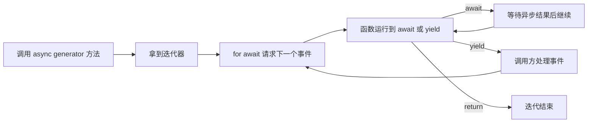

# 附录：读 Runtime 够用的 TypeScript



## 1. 只学会影响执行链理解的语法

| TS 写法 | 这里怎么读 | Java 类比与区别 |
|---|---|---|
| `interface AgentBackend` | 一个对象要满足的能力契约 | 类似 interface，但 TS 主要按结构匹配 |
| `abstract class BaseAgent` | 公共入口 + 子类实现扩展点 | 很接近 Java 抽象类/模板方法 |
| `extends` / `implements` | 继承实现 / 满足契约 | 可直接借用 Java 经验 |
| `Promise<T>` | 将来产生 T 或失败 | 类似 CompletableFuture，不代表新线程 |
| `async` / `await` | 异步函数 / 暂停此流程等结果 | await 时其他任务仍可运行 |
| `async *` / `yield` | 逐步产生异步事件 | 类似异步 Publisher 思路，不是阻塞 Stream |
| `yield* child()` | 转发子 generator 的事件 | 把子流程输出接入当前流 |
| `type A = X \| Y` | 可以是 X 或 Y 中一种 | 类似联合多个 sealed 子类型 |
| `Record<string, unknown>` | 字符串 key 到未知值的对象 | 类似 Map<String, Object>，仍需缩窄/验证 |
| `field?: T` | 字段可不存在 | 不是 Java Optional 对象 |
| `obj?.fn?.()` | 对象/方法存在才调用 | 空值检查的简写 |
| `x ?? defaultValue` | 仅 null/undefined 时使用默认值 | 不会把 0、false、空字符串当成缺失 |
| `{ ...config, model }` | 浅拷贝并以右侧覆盖同名字段 | 不是深拷贝 |
| `import type` | 只导入编译期类型 | 不代表运行时加载服务 |
| `as SomeType` | 告诉编译器按这个类型看待值 | 不是运行时转换或校验 |
| `void somePromise()` | 不等待该 Promise | 不代表异常自动被处理 |

## 2. 最值得真正掌握的一段

简化示意：

```typescript
async function* chat(message: string): AsyncGenerator<AgentEvent> {
  yield { type: 'status', message: 'starting' };
  const result = await runSomething(message);
  yield { type: 'text_complete', text: result };
  yield { type: 'complete' };
}

for await (const event of chat('hello')) {
  await processEvent(event);
}
```

调用 `chat('hello')` 先得到迭代器；消费迭代器才驱动函数主体。它在 `yield` 处把控制权交给调用方，在 `await` 处等待异步结果。

但不要推出“底层生产者也一定随消费速度暂停”：Pi 子进程会独立产生事件，EventQueue 只是将它们暂存后供 generator 消费；Claude 保活消费者同样可把消息送进本轮通道。

因此，异步 generator 接口统一了消费方式，并不自动提供整个系统的端到端背压。

## 3. 联合类型让事件处理可读

简化示意：

```typescript
type Event =
  | { type: 'text_delta'; text: string }
  | { type: 'tool_result'; toolUseId: string; result: string };

function handle(event: Event) {
  if (event.type === 'tool_result') {
    // 编译器在此知道存在 toolUseId 和 result。
    recordTool(event.toolUseId, event.result);
  }
}
```

本仓库的 `AgentEvent` 和 `PreToolUseCheckResult` 都使用这种方式。先看 `type` 分支，再看分支需要的字段，比试图一次记住整个大接口有效。

TS 类型通常在运行时被擦除。跨进程 `JSON.parse` 得到的数据即使被 `as` 成某类型，也不因此完成 schema 校验；要区分类型声明与真正的运行时检查。

## 4. 回调与闭包就是控制反转的实现工具

简化示意：

```typescript
const permissionPromise = new Promise<boolean>((resolve) => {
  pendingPermissions.set(requestId, { resolve });
});
onPermissionRequest({ requestId, toolName });
const allowed = await permissionPromise;
```

`resolve` 被保存到 map，稍后权限回复再找到它并调用。它就是等待中的流程恢复点；不需要循环轮询，也不需要为等待用户分配一个线程。

箭头函数还会捕获外部的 `managed`、`sessionId` 等变量，后端回调才能更新原会话。但捕获的是共享对象，不是自动生成的不可变快照；旧异步任务可能仍持有它，这正是 generation、状态标记和清理逻辑重要的原因。

## 5. 暂时不需要钻研的内容

第一轮可以跳过复杂泛型、条件类型的技巧、前端响应式状态、构建器底层和供应商 SDK 的全部类型定义。遇到不熟悉的类型，先判断它是配置、事件、控制结果还是回调，再追调用者和被调用者。

阅读目标是能够解释运行行为：一个异步结果由谁完成，一个事件在哪里消费，一份状态何时失效。理解这些比掌握更多 TS 语法更直接地帮助你读懂本项目。
