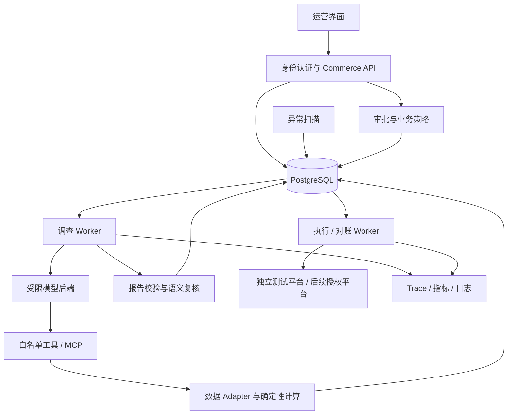

# 00：总体设计与共享契约

状态：01 相关契约已落地；02—07 扩展仍为设计。各链路引用此文件，不能各自定义不兼容的任务、权限和状态字段。

> 工作区执行更新（2026-09-18）：当前目录为 `/Users/chenglin.zhou/Projects/Demo/agent/craft-agents-oss`，分支 `codex/production-upgrade-01`。commerce 基线、任务/运行契约、受限模型驱动、MCP dispatcher、SQLite 记录和 20 条开发集已落地；生产数据库、真实身份和多 Worker 仍由 02—04 实现。

## 1. 现状和复用位置

以下路径均相对仓库根目录：

| 已有入口 | 当前事实 | 升级方式 |
| --- | --- | --- |
| `packages/commerce-agent/src/diagnosis/workflow.ts` → `runDiagnosisCase` | 固定案例、时间与九次预定调用 | 保留规则基线，新增通用任务入口 |
| `packages/commerce-agent/src/tools/context.ts` → `CommerceToolDependencies` | Adapter 绑定具体 Fixture 类 | 注入领域接口和可信执行上下文 |
| `packages/commerce-agent/src/reports/validate-report.ts` | 重算 KPI、核对引用、正则措辞检查 | 扩展版本、新鲜度和独立语义审查 |
| `packages/commerce-agent/src/approvals/approval-service.ts` | 审批人来自调用参数 | 改为服务端授权主体 |
| `packages/commerce-agent/src/execution/execution-service.ts` | 依赖同步 MockExecutor | 异步执行端口、发送前记账、多态对账 |
| `packages/commerce-agent/src/recovery/runner.ts` | 本地 Case 边界恢复 | 保留回归，新增持久 Worker |
| `packages/commerce-agent/src/storage/database.ts` | 单机 SQLite 表 | 演示兼容层与 PostgreSQL 生产实现 |
| `packages/shared/src/agent/backend/factory.ts`、`types.ts` | 模型工厂和 AgentBackend | 验证可裁剪工具后复用，隔离提供方差异 |
| `apps/webui/src/App.tsx`、`packages/server/src/index.ts` | 已有界面和服务器 | 审查集成点，业务接口留在 commerce 模块 |
| `Dockerfile.server` | 既有服务镜像 | 检查可复用部分，增加独立 commerce 运行配置 |

历史实现的说明位置为 `packages/commerce-agent/docs/architecture.md` 和 `docs/evaluation-report.md`（当前工作区均缺失）；基线补齐后再核验，不能使用旧目录测试结果代替当前验收。

## 2. 目标架构与进程边界

采用模块化单体加独立进程，不预先拆出大量微服务。API、调查 Worker、执行 Worker 可使用同一代码库，但启动配置、数据库权限及凭据不同。模型端只允许查询、报告校验和提案，不拥有 approve/execute 工具。

模型后端是否能禁用通用 Shell、任意文件和额外网络工具是 01 的进入性验证。若不满足，使用受限 Tool Calling 驱动并以 ADR 记录；不能仅凭 Prompt 声称隔离。

## 3. 通用任务与运行契约

拟新增 `src/contracts/task.ts`、`runtime.ts`，采用 Zod 严格解析、服务端生成 ID。

| 对象 | 必需字段/约束 |
| --- | --- |
| `InvestigationTask` | schemaVersion、taskId、tenantId、shopId、question、目标 SKU/campaign、baseline/current 时间窗、timezone、currency、asOf、budget、requestedBy |
| `PrincipalContext` | actorId、tenantId、允许的店铺、角色/权限、认证来源；只能由可信 API/Worker 构建 |
| `RunContext` | runId、taskId、attempt、traceId、parentRunId、deadline、配置版本；04 再加入 leaseEpoch |
| `InvestigationState` | facts、hypotheses、counterEvidence、missingData、pendingSteps、evidenceRefs、工具历史摘要、剩余预算 |
| `RunManifest` | gitCommit、model/provider、可用时的具体模型版本、prompt/skill/tool/schema/config/data 版本、实际 usage、结束原因 |

tenant 是商家组织，一个 tenant 可有多个 shop。所有业务对象从第一条链路起带 tenant/shop；01 本地 demo 使用服务端固定身份，不提供可自行指定身份的公网入口。

将“调查是否完成”与“建议是否执行”分开。拟定调查状态：`QUEUED/RUNNING/WAITING_INPUT/REPORT_READY/FAILED/CANCELLED/TIMED_OUT`。`REPORT_READY` 可以承载 `RESOLVED/NEEDS_DATA/UNRESOLVED` 报告，不强行生成动作。

提案保持独立状态：`PENDING_APPROVAL/APPROVED/REJECTED/EXPIRED/EXECUTING/SUCCEEDED/FAILED/UNKNOWN`，必要的内部 DRAFT 可保留。人工处理标记与原因附着在 UNKNOWN，不把“交给人工”伪装成执行成功。

## 4. 工具、数据和报告契约

拟新增 `CommerceAdapter`，方法对应现有销售、库存、促销、商品和广告查询。参数包含可信作用域、时间窗口、snapshot/version、cursor/limit、AbortSignal；返回 typed data、status、nextCursor、sourceMetadata、warnings。后端不接受任意 SQL 或文件路径作为模型参数。

Evidence 包含 tenant/shop、source、sourceRecordIds、eventTimeRange、ingestedAt、asOf、snapshotId、contentHash、schemaVersion、metricDefinitionVersion 和引用粒度。证据 ID/唯一键必须包含隔离作用域，不允许跨租户去重导致信息泄露。

报告校验分开输出：

- `structuralValidation`：Schema、引用可解析、作用域、单位、数值重算；代码硬门禁。
- `freshnessValidation`：数据是否完整、快照是否过期、版本是否匹配；影响是否可提案。
- `semanticReview`：逐项结论支持/反驳/无法判断，引用证据与理由；模型复核是辅助信号，不产生授权。

把“审核状态”和“业务调查状态”分开，NEEDS_DATA 报告可以展示，但不能绕过已有动作门槛。启发式 confidenceScore 不解释为统计概率。

## 5. 存储、迁移和事务

02 负责 Repository 接口与 PostgreSQL 实现，后续链路不再重复改造存储。各 Repository 暴露异步方法，事务通过统一 UnitOfWork 显式传递；不能把原 SQLite 同步 transaction 回调直接改成 async 后继续使用。

实体至少覆盖：tenant/shop、导入批次/原始记录/同步游标、Evidence、Report、Case/Run/事件、Proposal/Approval/Attempt/Audit。03 扩展身份绑定，04 扩展 jobs/outbox/lease，06 扩展监控与反馈。

SQLite 保留原 demo/确定性回归。生产运行只使用 PostgreSQL，不采用无一致性设计的双写。旧数据迁移为显式离线导入：先只读备份、指定租户映射、校验数量与哈希，再导入新库；不自动修改用户原 SQLite。新旧报告哈希规则变更通过 schemaVersion 和旧版本验证器兼容。

业务状态和待处理事件一起提交；网络调用必须在数据库事务外。可再生成的 Markdown 由数据库报告派生，文件写失败不能丢失主记录，也不能把未持久化报告显示为成功。

## 6. 审批与远端动作不变量

审批绑定 proposalHash、策略版本、数据快照、动作参数、目标版本、有效期和可信主体。到执行前重新检查授权/撤销状态、有效期、变化上限、数据新鲜度与目标版本。

拟定 `ActionExecutor`：`capabilities()`、`execute(request, signal)`、`lookup(requestId)`；lookup 返回 `APPLIED / REJECTED / PENDING / NOT_FOUND / UNAVAILABLE`，包含结果是否具权威性、远端版本及 retryAfter。

发送前生成并持久化 requestId/idempotencyKey。网络失败不等于动作失败；非权威 NOT_FOUND 不等于未执行。远端不支持幂等或查询时，写请求结果不确定后保持 UNKNOWN，禁止自动重发。补偿是新的需审批动作，不宣称数据库回滚能撤销外部业务。

租约和 fencing 约束本地提交；它们本身不能阻止已经离开进程的远端请求。重复副作用还依赖远端幂等、条件更新或禁止自动重发，04 必须分别验证。

## 7. Trace、预算和完成信号

所有环节关联 taskId/runId/traceId，工具增加 toolCallId，审批与执行关联 proposalId/requestId。记录模型可见的计划、工具与结果摘要即可，不要求获取提供方未公开的内部推理。

预算同时限制模型步数、工具次数、输入/输出 token、deadline 和金额估算。计费规则带版本；缺失实际 usage 时标 unknown/estimated，不记为零成本。重试计入预算，取消传播到模型与工具；外部写已发出时取消转结果核实而不是简单终止记账。

可观测数据默认脱敏。原始模型记录若为复现而保留，需要访问控制、保留期和删除策略。业务审计和调试日志分开。

## 8. 依赖与运行模式

保留 TypeScript、Bun、MCP、Zod。执行时核对并锁定兼容版本，不直接照抄历史版本号。新增 PostgreSQL 客户端、身份验证库、OpenTelemetry 和浏览器测试依赖需说明用途。

运行模式明确为 `fixture`、`sandbox`、`pilot`。测试平台端点由服务端配置，不接受模型传入 URL。pilot 所需真实授权、模型配置和成本上限，在使用前检查；不得从机器上搜集无关密钥。

## 9. 参考依据

- 动态调查与确定性控制的边界参考 [Building effective agents](https://www.anthropic.com/engineering/building-effective-agents)。
- 真实执行结果、多次试验和分层评分参考 [Demystifying evals for AI agents](https://www.anthropic.com/engineering/demystifying-evals-for-ai-agents)。
- 店铺隔离的数据库补充机制参考 [PostgreSQL Row Security](https://www.postgresql.org/docs/current/ddl-rowsecurity.html)；表所有者与 BYPASSRLS 的特殊行为必须纳入测试。
- 队列领取可评估 [PostgreSQL SELECT / SKIP LOCKED](https://www.postgresql.org/docs/current/sql-select.html)；跳锁查询只用于队列，不作为一致业务查询的替代。
- 观测信号参考 [OpenTelemetry Signals](https://opentelemetry.io/docs/concepts/signals/)。

以上仅为设计参考，不是项目已实现证明。
