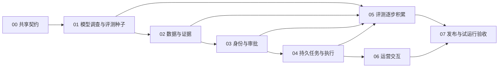

# 电商 Agent 生产化升级：Plan-and-Execute 入口

规划日期：2026-09-18。当前状态：01 已完成 B00—B07 并达到 CODE_READY；真实模型 B08 待外部配置。02—07 尚未开始。

工作目录已更正为 `/Users/chenglin.zhou/Projects/Demo/agent/craft-agents-oss`。commerce 基线和 01 动态调查运行时已迁入并通过当前工作区回归；详细执行证据位于 `packages/commerce-agent/docs/implementation/01/`。

本目录承接 [上一轮五条执行链路](../re-create/execution/README.md)。旧链路保留为本地原型的实施记录，本目录定义下一轮增量升级，不将计划能力计入现有成果。

## 1. 目标与完成边界

将 Commerce Copilot 升级为可部署、可使用实际经营数据、可由真实模型完成调查、可审核执行并在故障后恢复的电商经营 Agent。面向秋招，重点形成动态调查、证据约束、可靠执行、真实评测四类可解释的工程成果。

首轮聚焦两个业务场景：

- 广告效率下降：调查销售、库存、促销与广告数据，生成预算调整提案，在测试平台完成审批、执行、对账闭环。
- 销量与利润异常：调查缺货、促销、退款和口径冲突，生成有证据的诊断和补货/促销工单建议；首轮不实现供应链自动履约。

完成等级分开记录：

| 等级 | 所需证据 | 允许说明的边界 |
| --- | --- | --- |
| 工程验收 | 七条链路验收、真实模型评测、独立测试平台故障演练、部署恢复记录 | 具备经过验证的生产化工程能力 |
| 受控试运行 | 经授权的实际数据、明确使用者、限定环境与观察周期、反馈记录 | 在所列范围内完成试运行 |
| 真实业务生产 | 真实平台授权、上线和持续运维证据 | 只描述实际发生的部署、使用及指标 |

模拟数据、网络测试平台、历史导出文件、实时平台接口必须分别标识。没有真实数据或模型凭证时，可以完成相关代码，但对应外部验证保持待验收。

## 2. 文档与链路

| 文档 | 主要产物 | 进入条件 |
| --- | --- | --- |
| [00 总体设计与共享契约](./00-总体设计与共享契约.md) | 架构、状态、接口、存储与安全边界 | 所有链路必读 |
| [01 真实模型与动态调查](./01-真实模型与动态调查链路.md) | B00—B08、输入输出/状态契约、42 项断言、20 条评测种子 | 先核验并补齐当前目录缺失的 commerce 基线 |
| [02 数据接入与证据治理](./02-数据接入与证据治理链路.md) | PostgreSQL Repository、数据导入、证据版本、语义复核 | 01 的任务及 Adapter 契约稳定 |
| [03 身份授权与审批治理](./03-身份授权与审批治理链路.md) | API、身份上下文、店铺隔离、审批策略 | 02 的数据库与证据契约稳定 |
| [04 持久任务与可靠执行](./04-持久任务与可靠执行链路.md) | Worker、租约、Outbox、外部执行与对账 | 03 的授权和审批契约稳定 |
| [05 真实评测与回归门禁](./05-真实评测与回归门禁链路.md) | 60 条目标案例、基线、消融、发布门禁 | 种子工作从 01 开始；完整验收依赖 01—04 |
| [06 运营交互与业务反馈](./06-运营交互与业务反馈链路.md) | 案例工作台、人工审批、监控去重、案例反馈 | 03 API、04 任务与事件契约；发布前通过 05 |
| [07 部署运维与试运行验收](./07-部署运维与试运行验收链路.md) | 部署、CI、观测、压测、备份恢复、交付包 | 01—06 的验收证据齐全 |
| [执行记录](./EXECUTION-LOG.md) | 当前状态、执行批次、验证、偏差、交接 | 每个执行批次更新 |

建议单人顺序为 01 → 02 → 03 → 04 → 05 → 06 → 07。05 的数据与评分基础在 01 建立，02—04 每条补充案例；07 的数据库测试环境在 02 建立，日志字段从 01 统一。这样不会到最后才发现系统无法评测或无法运行。



## 3. Plan-and-Execute 工作约定

这里的 Plan-and-Execute 是项目实施方法，不强制系统内部采用某个同名 Agent 框架。

每条链路采用一个完整循环：

1. **Plan**：读本入口、00、当前链路全文、执行记录和指定源码；检查当前工作区、依赖版本及上一条产物。将本轮任务、文件、验收项和风险记入执行记录。
2. **Execute**：按文档内的任务编号分批实现，每批形成可验证的纵向结果。沿用现有接口能满足需求时优先复用。
3. **Verify**：执行针对性测试、受影响回归和必要的真实环境验证。记录退出码、环境、样本数和原始产物位置。
4. **Review**：检查是否达到业务完成条件、是否误用身份/证据、是否引入不可恢复状态、是否只在 Mock 中成立。
5. **Replan**：只有出现实际证据使原计划不成立时调整后续任务；写明原因、影响到的契约和重新验证范围，更新受影响文档。
6. **Handoff**：记录已完成项、未完成项、剩余外部条件及下一链路入口。达到门槛后更新状态。

常规文件组织、依赖选择和局部重构可在当前范围内自行决定并记录。不需要为每个小步骤另行确认。缺失凭证只阻塞真实调用；缺失数据授权只阻塞真实数据使用；其他独立工作继续。

用户说“开始第 N 条链路”时，实施该链路到验收或明确外部阻塞。跨链路只做当前验收必需且已在计划声明的前置工作，不自动展开剩余全部功能。本轮用户只要求规划，不开始业务代码改动。

可直接用于后续编码会话的执行指令：

```text
执行 tutorials/production-upgrade/NN-对应链路.md。
先读 README、00、当前链路全文和 EXECUTION-LOG，核验依赖与当前源码。
把本轮可完成的任务及验收步骤写入执行记录，再编码、测试、审查和交接。
依据实际失败调整计划并同步受影响契约，不跳过必需验收，不把模拟结果当真实结果。
本轮做到该链路验收；缺外部条件时完成其他独立工作并准确记录阻塞。
```

计划编号用于任务导航，不表示运行时必须使用七个 Agent。目录调整可以记录后采用，权限边界和完成标准的缩减必须说明原因及其对目标的影响。

## 4. 状态与通过规则

统一状态：`PLANNED → IN_PROGRESS → CODE_READY → VERIFIED`；外部条件缺失时为 `BLOCKED_EXTERNAL`，并保留已完成工作及可并行事项。

- `CODE_READY`：实现和可本地运行的验证完成；不能表示真实模型/API 已验证。
- `VERIFIED`：该链路完成门槛全部满足，原始记录可定位。
- 失败项不能改成 skipped 再计为通过；必需外部验证 skipped 时不能升级 VERIFIED。
- 一个链路外部验收受阻，但契约与本地测试稳定，可以推进不依赖该外部结果的下游工作；最终发布门禁仍保留阻塞。
- 任何高风险权限越界、重复业务副作用、不可解释数据损坏，均阻塞工程发布。

## 5. 验证与 Git 约定

commerce 基线与 01 新增命令已经落地，可直接执行：

```bash
bun run commerce:typecheck
bun run commerce:test
bun run commerce:test:mcp
bun run commerce:eval
bun run commerce:eval:failures
```

每批运行与改动有关的检查；链路收尾运行完整电商回归。修改 shared/server/webui 时补相应检查。文档中的新增脚本均为“拟新增”，执行者必须先实现脚本，再将它作为验收命令。

Git 操作按当次授权执行。提交前检查 diff，仅暂存本链路相关文件；不使用 `git add .` 混入现有简历、tutorials 迁移、`.DS_Store` 或 `node_modules`。不自动 push、合并或部署。本轮规划不执行 commit。

## 6. 优先级和取舍

核心深度：动态工具选择与上下文、证据与语义边界、跨系统执行恢复、真实模型评测。支撑完整性：身份隔离、可用界面、部署和观测。

首轮不引入多 Agent 团队、模型微调、通用任意 SQL、全平台连接器、向量数据库、Kubernetes 或自动真实调预算。增加组件必须说明当前故障/评测证据、替代方案、收益和运行成本。

单人按验收批次推进，不把日历估时当承诺。01 完成后记录实际投入与模型成本，再为剩余链路估时。每条完成时保留一个成功案例和一个失败/拒绝/恢复案例作为后续面试材料。

## 7. 规划基线

初版规划依据旧工作区 `0561730` 的历史记录。2026-09-18 在用户指定的新目录从 HEAD=`e8963854` 建立 `codex/production-upgrade-01`，完成 B00 基线恢复和 B01—B07 实现；fake/fixture 测试不替代真实模型或真实经营数据证据。

下一次执行入口：[01 真实模型与动态调查链路](./01-真实模型与动态调查链路.md)。
