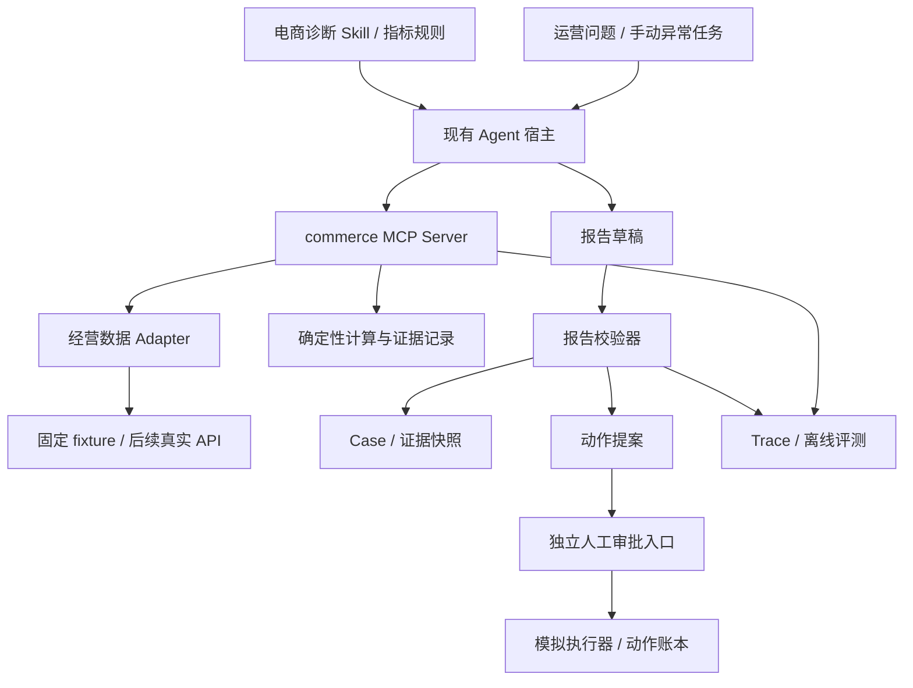

# 电商 Agent 改造计划

> 本文件是用户已选定的改造范围。按阶段 0—4 完成只读诊断、人工审批与模拟执行、Case 恢复和离线评测；阶段 5 保留为可选扩展。逐任务实施顺序、文件位置、验收命令及交付门槛见 [详细执行计划](./04-详细执行计划.md)。

## 1. 本次改造要得到什么

将项目定位为“Commerce Copilot：电商经营诊断 Agent”。服务对象是商家运营人员，首个任务是调查单个 SKU 在两个可比时间窗中的销量或净销售额下降，给出证据、备选解释及处置建议。

一次完整交互示例：

> 调查演示店铺 SKU-A 最近七天净销售额下降的原因，检查是否缺货、促销是否结束，说明是否适合增加投放，并生成待审核建议。

目标输出：

- 明确比较范围：店铺、SKU、时间窗、时区、币种和指标口径。
- 调用销售、库存、促销工具；广告数据在第二阶段接入。
- 计算可复现的差异，列出支持证据、反证和缺失信息。
- 返回结构化报告与 Markdown 展示；证据不足时明确返回未决结果。
- 有必要时生成动作提案，交由人工审核；演示执行只修改独立模拟账本。

先保留现有聊天、工具事件、报告展示和会话交互。首版采用固定样例数据和手动触发，不依赖真实 ERP、广告账户或商家授权。先完成调查链路，再补自动监控和真实连接器。

## 2. 项目差异化在哪里

| 新增能力 | 需要完成的工程产物 | 解决的问题 |
| --- | --- | --- |
| 经营数据接入 | 固定数据集、Adapter、MCP 工具、统一证据结构 | 数据来自不同系统，口径不一致 |
| 诊断流程 | 领域 Skill、报告 Schema、报告校验器 | 模型跳步、漏查或无证据断言 |
| 经营约束 | 确定性金额计算、毛利与库存规则 | 模型算错金额或给出不可执行建议 |
| 受控处置 | 动作提案、人工审批入口、模拟执行器 | 审批与参数脱节、重复执行 |
| 案例恢复 | Case 存储、证据快照、动作账本 | 会话恢复后沿用过期结论 |
| 评测 | 离线案例、调用轨迹、确定性检查和人工复核 | 演示成功不能证明整体可靠性 |

以上是计划新增的个人工程工作。已有模型 SDK 适配、通用事件流和桌面界面作为依赖复用，避免把它们计为此次新增成果。

## 3. 改造架构



独立电商 MCP 服务负责领域数据、计算、约束和持久化。现有宿主负责模型交互、工具选择、Skill 加载和通用权限。二者通过工具输入输出连接，不将 SKU 或促销逻辑塞进通用 Agent 核心。

采用当前已有 TypeScript、Bun、MCP SDK、Zod 和 Bun Test。先固定一个已配置且可用的模型后端，跑通后再做多后端回归。当前会话存储不改；领域数据使用 JSON fixtures，Case 和动作账本在后续阶段使用独立 SQLite 文件，通过 Bun 子进程访问。

SQLite 使用项目已采用的 `bun:sqlite` 路线，但不复用 Pages 的数据文件或表。Bun 专用依赖必须留在电商进程内，不能从 Electron 或通用 shared 入口静态导入。

## 4. 已核对的扩展入口

以下路径为当前真实存在的源码；行号可能随后续修改变化，优先按符号定位。

| 现有入口 | 已有行为 | 此次使用方式 |
| --- | --- | --- |
| `packages/shared/src/sources/types.ts` → `FolderSourceConfig` / `McpSourceConfig` | Source 支持 MCP stdio，配置 command、args、env | 注册独立 commerce Source |
| `packages/shared/src/sources/server-builder.ts` → `SourceServerBuilder.buildMcpServer` | stdio 配置转换为子进程启动信息 | 复用，首版不改 |
| `packages/shared/src/skills/storage.ts` → `loadSkillBySlug` / `loadAllSkills` | 加载 workspace / project / global Skill | 使用独立 workspace Skill，便于演示安装 |
| `packages/shared/src/skills/types.ts` → `requiredSources` | Skill 可声明 Source 依赖 | 声明 commerce |
| `packages/server-core/src/sessions/SessionManager.ts` → `Pre-enable sources required by invoked skills`，约 6000 行 | 在 `options.skillSlugs` 有值时预启用可用 Source | 显式选中 Skill 并验证 source 激活事件 |
| `packages/shared/src/agent/base-agent.ts` → `chat` | 注册 Skill 读取前置条件并装配上下文 | 承接诊断 Skill，业务流程需另行定义 |
| `packages/shared/src/agent/core/pre-tool-use.ts` → `runPreToolUseChecks` | 权限、Source 激活和读取前置检查 | 作为宿主执行前检查，业务规则在电商工具端验证 |
| `packages/shared/src/agent/permissions-config.ts` → `applySourceConfig` | Source 规则自动加前缀；配置追加放行 | 精确配置只读工具，不能假设覆盖了默认规则 |
| `packages/shared/src/sessions/storage.ts` → `saveSession` / `loadSession` | 保存和恢复对话 | 复用对话，不将其当作业务动作账本 |
| `packages/session-mcp-server/src/index.ts` → `ListToolsRequestSchema` / `CallToolRequestSchema` | 现有 MCP 服务的注册与分发写法 | 参考协议用法，新建电商 Server |
| `packages/shared/src/pages/data-store.ts` | Bun 专用 SQLite 的既有使用方式 | 仅参考运行时边界，新建领域表 |

外部 Source MCP 进程不会自动获得 `SessionToolContext`。首版通过服务端固定的演示店铺范围与工具参数中的 `case_id` / `run_id` 关联任务；这些 ID 不是身份凭证。真实商家授权由服务端身份绑定，不能相信模型传入的 `shop_id`。

## 5. 目标目录与文件职责

下面都是拟新增路径，不表示文件已经存在。

```text
packages/commerce-agent/
  package.json                 # @commerce/agent，独立测试与类型检查
  tsconfig.json
  src/
    server.ts                  # MCP stdio 入口；stdout 只输出协议
    contracts/                 # 工具、证据、Case、报告、动作 Schema
    adapters/
      commerce-adapter.ts      # 与模型无关的数据接口
      fixture-adapter.ts       # 首版实现
    domain/
      metrics.ts              # 时间窗、销量、净销售额、退款口径
      margin.ts               # 金额、成本与促销模拟
      constraints.ts          # 毛利/库存/动作条件
    tools/                    # 查询、计算、报告校验与提案工具
    workflow/                 # 状态校验、缺失证据检查
    storage/                  # 后续 Case、evidence、actions 独立表
    trace/                    # 工具调用与报告校验记录
    approval/                 # 后续人工审批 CLI；不注册为 Agent 工具
    executor/                 # 后续 mock 执行器与重试处理
  tests/
  fixtures/
    v1/                       # 原始数据 + manifest，禁止放答案
  eval/
    gold/                     # 期望结论与禁止动作；不暴露给工具
    run.ts                    # 案例回放入口，后续实现
    score.ts
examples/commerce-workspace/
  sources/commerce/
    config.template.json
    guide.md
    permissions.json
  skills/commerce-diagnosis/
    SKILL.md
    references/               # 指标、调查 SOP、规则和输出约定
scripts/setup-commerce-demo.ts # 后续实现；安装独立演示 workspace
```

选择 `packages/commerce-agent` 是为了复用根目录 `packages/*` workspace。旧选题稿中的 `examples/commerce-agent` 由此替代；`examples` 只存可复制的配置模板。

根 `package.json` 后续增加 commerce 脚本；根 `typecheck:all` 是显式链式命令，新增包不会自动加入，必须补入口。现有根 `test` 有 Bun 测试发现逻辑，领域测试应同时支持包级快速运行和根级回归。

不预先修改 SourceServerBuilder、BaseAgent、SessionManager、session-tools-core 工具注册表或通用系统提示词。只有集成测试证明扩展入口有缺口，才提交局部核心改动，并写对应回归测试。

## 6. 分阶段实施

### 阶段 0：锁定业务口径与可复现数据

任务：固定一个演示店铺，设计三个 SKU（含同商品不同规格），提供相邻两个七天窗口的订单、退款、库存和促销。先实现 FixtureAdapter、Zod Schema 和确定性指标函数。

推荐第一例：销售额下降时，库存中途归零；促销没有变化、客单价稳定。再添加反例：库存正常、促销结束导致转化下降。这里的“根因”是合成场景设定，只能用于离线验证。

完成标准：不调用 LLM 也能准确输出两个窗口的指标、数据新鲜度和证据 ID。金额、时区、退款归属和 SKU 规格测试通过。原始数据和评测答案分离。

### 阶段 1：接通只读电商 MCP 工具

任务：新增 query_sales、query_inventory、query_promotions、compute_margin；query_ads 延后至阶段 2。实现工具注册、参数校验、查询超时、结果分页、错误类型、source guide 和 Source 模板。

完成标准：MCP 客户端可列出并调用工具；宿主显式启用 commerce Source 后能看到工具结果；错误或缺数据不会被替换成有效零值；金额计算由代码完成。每个调用产生 run_id、参数摘要、证据引用与耗时记录。

里程碑：这是领域工具原型，尚不代表完整诊断 Agent。

### 阶段 2：跑通诊断 Skill 与报告校验

任务：安装 commerce-diagnosis Skill，声明 requiredSources，定义调查顺序和输出格式；增加 query_ads 与广告口径说明；完成 validate_report 工具和报告 renderer。

让模型处理问题拆解、工具选择、假设与叙述。让代码处理计算、字段约束、证据引用、时间窗与权限。Skill 中的步骤属于流程引导；验收必须通过工具端校验器，不能只检查回答是否提到了这些步骤。

完成标准：正常、异常、证据不足三个样例都能产出符合预期的报告；所有关键数值能回到工具结果；无效报告不能进入后续动作提案。证据不足输出 NEEDS_DATA / UNRESOLVED，而不是编造确定根因。

里程碑：到此形成可演示的只读 MVP，可作为第一次项目验收。

### 阶段 3：动作提案、人工审批与模拟执行

任务：新增 propose_action，只接受通过校验的报告；新增独立人工审批 CLI、动作状态表、参数摘要、幂等键及 mock 执行器。先做一种动作，例如调预算；改价和补货后续按相同契约扩展。

审批入口不注册到模型可调用的 MCP 工具集。演示由用户在独立终端审核；这是可信本地操作假设，不等价于真实企业身份和审批系统。若要把身份权限做强，需后续独立服务与真实认证。

完成标准：拒绝、过期、参数更改、重复提交和执行超时都被覆盖；同一动作只产生一次模拟业务效果。执行结果未知进入 UNKNOWN，先查询模拟账本，禁止直接重试。

里程碑：得到“人审后执行”的可复现原型。真实改价、真实广告调预算和补货接口不在当前实施范围。

### 阶段 4：Case Memory、轨迹与离线评测

任务：持久化 Case、证据快照和动作状态；恢复时重新确认关键数据版本；建立固定离线集，比较单轮基线与工具驱动 Agent。实现确定性评分、人工结论复核及失败类别报告。

完成标准：中断后能恢复调查证据，过期快照触发刷新，已执行动作不会重复；保留 raw trace、模型标识、数据版本与评测配置。报告实际观察到的结果，不以目标阈值冒充结果。

里程碑：可以说明“工具如何接入、为何这样编排、失败怎样处理、效果如何验证”，适合作为秋招核心项目。

### 阶段 5：按实际需要扩展

- 自动 Monitor / Detect：先做 CLI 定时导入与阈值扫描，创建 Case 后再唤起调查；加入任务去重，避免每次扫描重复开单。
- 真实数据 Adapter：选择一个已获授权的数据源，完成凭据、限流、分页和增量同步；保留 fixture 回放路径。
- 前端增强：将证据表、待审批提案和案例列表做成专用视图，早期继续使用现有工具卡片和 Markdown。
- RAG：当经营规则/历史案例规模确实需要检索时再增加；首版使用固定规则文档和按 SKU/时间检索。

这些扩展不阻塞阶段 2 的 MVP，也不阻塞阶段 4 的工程项目交付。

## 7. 数据和权限上的具体决策

1. 先实现查询，再实现草稿，再实现 mock 执行。查询权限与商业动作授权分别判断。
2. 金额使用最小货币单位整数；多币种拒绝直接求和；任何毛利口径都要写明是否扣广告费和履约成本。
3. 利润、ROAS 等用确定性公式计算；模型负责解释，不重新编造数字。
4. Source 自定义权限是追加规则。既有默认规则、Bash 和 allow-all 不能当作本项目隔离保证；首版无真实写入凭据，电商服务按启动模式限制能力。
5. JSONL 保存对话；领域 Case 和动作表负责业务状态。SQLite 的本地事务不等于外部系统 exactly-once。
6. Trace 先覆盖新电商工具的确定性调用链；需要整段模型过程时再消费现有 AgentEvent，不把全部事件协议改造为电商专用。

## 8. 实施顺序与交付物

建议按依赖顺序做小提交：数据模型 → fixture 与计算 → MCP → Source/Skill → 报告校验 → 提案/模拟执行 → 恢复/评测。单人可按约两到三周组织第一轮，属于计划估算，实际取决于当前代码熟悉程度与模型联调情况。

优先完成阶段 0—2；不以完善 UI 或接真实业务账户作为开始演示的前提。每个阶段留下源码、测试输出、样例输入、实际输出和一次失败案例解释。

推荐阅读顺序：[详细执行计划](./04-详细执行计划.md) → 当前任务所需的 [契约文档](./02-电商数据工具与审批契约.md) → [验收清单](./03-实施任务与验收清单.md)。详细计划不改变本文件的业务范围，只将任务、依赖与验证具体化。
